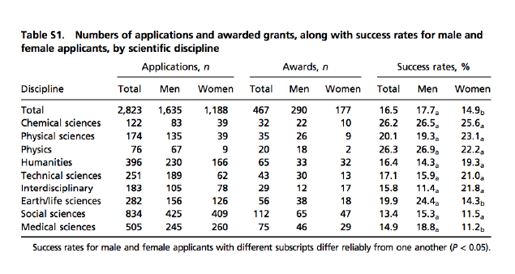

cases 1
================
DanielH
April 1, 2019

-   [case one: US murders data](#case-one-us-murders-data)
-   [case two: heights](#case-two-heights)
-   [case three: extracting tables from a PDF](#case-three-extracting-tables-from-a-pdf)

``` r
library(tidyverse)
library(rvest)
library(dslabs)
library(janitor)
library(lubridate)
library(scales)
library(pdftools)
library(knitr)
library(ggthemes)
library(ggrepel)
library(listviewer)


# set theme
theme_set(theme_minimal())
```

case one: US murders data
-------------------------

We extract our data from Wikipedia

``` r
# get URL
url <- 
  paste0("https://en.wikipedia.org/w/index.php?title=",
         "Gun_violence_in_the_United_States_by_state&direction=prev&oldid=810166167")

# read Wikipedia html
murders_dat_raw <-
  url %>%
  read_html() %>%
  html_nodes("table") %>%
  html_table() %>%
  .[[2]] %>%
  setNames(c("state", "population", "total", "murder_rate"))
```

##### some cleaning

First, following Rafa' s approach, we remove the dots. We start by identifiying the cols where there are dots

``` r
# define function
commas <- 
  function(x) {
  x %>%
    str_detect(",") %>%
    any()
}


# call function
murders_dat_raw %>% 
  summarise_all(commas)
```

    ##   state population total murder_rate
    ## 1 FALSE       TRUE  TRUE       FALSE

``` r
# check some rows
murders_dat_raw %>%
  filter(str_detect(state, "^Ca|York|Tex"))
```

    ##        state population total murder_rate
    ## 1 California 38,993,940 1,861         4.8
    ## 2   New York 19,747,183   609         3.1
    ## 3      Texas 27,429,639 1,316         4.8

So, we have commas for cols 2 and 3, `population` and `total`. We now create a function `remove_commas()` to remove commas

``` r
# define function
remove_commas <- function(x) {
  x %>%
    str_replace_all(",", "") 
}


# call function and check
murders_dat_raw %>%
  filter(str_detect(state, "^Ca|York|Tex")) %>% 
  mutate_at(c(2,3), remove_commas) 
```

    ##        state population total murder_rate
    ## 1 California   38993940  1861         4.8
    ## 2   New York   19747183   609         3.1
    ## 3      Texas   27429639  1316         4.8

As we can see we have removed commas from cols 2 and 3. We save the object and also divide col 4 by 100

``` r
# wrangling
murders_dat <-
  murders_dat_raw %>% 
  mutate_at(c(2,3), remove_commas) %>% 
  mutate_at(4, ~./100)


# check
murders_dat %>%
  sample_n(4)
```

    ##        state population total murder_rate
    ## 1    Arizona    6817565   309       0.045
    ## 2 New Jersey    8935421   363       0.041
    ## 3   Missouri    6076204   502       0.083
    ## 4   Maryland    5994983   516       0.086

#### string splitting

A very common data wrangling operation is string splitting.

Suppose we did not have the functions `read_csv` or `read.csv` available to us. We instead have to read a csv file using the tidyverse function `read_lines()` like this

``` r
# read data
filename <- system.file("extdata/murders.csv", package = "dslabs")
lines <- 
  filename %>%
  read_lines()

# check
lines %>% head()
```

    ## [1] "state,abb,region,population,total" "Alabama,AL,South,4779736,135"     
    ## [3] "Alaska,AK,West,710231,19"          "Arizona,AZ,West,6392017,232"      
    ## [5] "Arkansas,AR,South,2915918,93"      "California,CA,West,37253956,1257"

As we can see we have strings with *state*, *abb*, *region*, *population*, *total* in them. We should have separate columns for each of those elements

``` r
# split and check some elements of the outputted list
lines %>%
  str_split(",") %>%   # output is a list
  head(4)
```

    ## [[1]]
    ## [1] "state"      "abb"        "region"     "population" "total"     
    ## 
    ## [[2]]
    ## [1] "Alabama" "AL"      "South"   "4779736" "135"    
    ## 
    ## [[3]]
    ## [1] "Alaska" "AK"     "West"   "710231" "19"    
    ## 
    ## [[4]]
    ## [1] "Arizona" "AZ"      "West"    "6392017" "232"

As we can see the first element of the output list contains column names. We can extract those names and save them to a variable. Then, we extract the remaining elements of the list and save them to a list object

``` r
# extract column names
column_names <-
  lines %>%
  str_split(",") %>%
  .[[1]]


# remaining list
lines_list <-
  lines %>%
  str_split(",") %>%
  magrittr::extract(-1) 
```

We now create a tibble

``` r
# create tibble
states_dat <-
  lines_list %>%
    {tibble(country = map_chr(.,1),
            abb = map_chr(.,2),
            region = map_chr(., 3),
            population = map_chr(., 4),
            total = map_chr(., 5))  %>%
        setNames(column_names)} %>%
     mutate_at(c(4,5), as.numeric)


# check
states_dat %>%
  filter(str_detect(state, "^Ca|York|Tex"))
```

    ## # A tibble: 3 x 5
    ##   state      abb   region    population total
    ##   <chr>      <chr> <chr>          <dbl> <dbl>
    ## 1 California CA    West        37253956  1257
    ## 2 New York   NY    Northeast   19378102   517
    ## 3 Texas      TX    South       25145561   805

A faster approach would be

``` r
# cleaning
states_dat2 <-
  lines_list %>% 
  transpose() %>%
  setNames(column_names) %>% 
  as_tibble() %>%
  map_df(unlist) %>%
  mutate_at(c(4,5), as.numeric) 


# check
states_dat2 %>%
  filter(str_detect(state, "^Ca|York|Tex"))
```

    ## # A tibble: 3 x 5
    ##   state      abb   region    population total
    ##   <chr>      <chr> <chr>          <dbl> <dbl>
    ## 1 California CA    West        37253956  1257
    ## 2 New York   NY    Northeast   19378102   517
    ## 3 Texas      TX    South       25145561   805

An even faster approach is

``` r
# cleaning
states_dat3 <-
  lines %>%
  str_split(",", simplify = T) %>%
  .[-1,] %>% 
  as_tibble(.name_repair = NULL) %>%
  setNames(column_names) %>%
  mutate_at(c(4,5), as.numeric)


# check
states_dat3 %>%
  filter(str_detect(state, "^Ca|York|Tex"))
```

    ## # A tibble: 3 x 5
    ##   state      abb   region    population total
    ##   <chr>      <chr> <chr>          <dbl> <dbl>
    ## 1 California CA    West        37253956  1257
    ## 2 New York   NY    Northeast   19378102   517
    ## 3 Texas      TX    South       25145561   805

We now cross check our tibbles, that is we check whether our tibbles are the same

``` r
# 3 vs 2
states_dat3 %>%
  identical(states_dat2)
```

    ## [1] TRUE

``` r
# 1 vs 2
states_dat %>%
  identical(states_dat2)
```

    ## [1] TRUE

case two: heights
-----------------

The following heights were obtained using a web form in which students were asked to enter their heights. They could enter anything, but the instructions asked for height in inches, a number, *unfortunately the column vector with the reported heights had several non-numeric entries and as a result became a character vector*:

``` r
# get data and convert to tibble
reported_heights <-
  reported_heights %>%
  as_tibble()

# check 40 random cases
set.seed(5931)
reported_heights %>% 
  select(3) %>% 
  filter(str_detect(height, "foot|yyy|>|cm|'|inch")) %>%
  pull(height) %>%
  sample(40)
```

    ##  [1] "5 feet and 8.11 inches" "165cm"                 
    ##  [3] "5 feet 6 inches"        "5'2\""                 
    ##  [5] "5'3\""                  "5' 11\""               
    ##  [7] "5' 7.78\""              ">9000"                 
    ##  [9] "5' 7\""                 "5'7.5''"               
    ## [11] "5'4"                    "5'11\""                
    ## [13] "5'7\""                  "5' 10"                 
    ## [15] "2'33"                   "5'10"                  
    ## [17] "5'5''"                  "5'3"                   
    ## [19] "5'7\""                  "5'11"                  
    ## [21] "5 feet 7inches"         "5'11''"                
    ## [23] "5'5"                    "Five foot eight inches"
    ## [25] "5'7"                    "6'3\""                 
    ## [27] "5' 4\""                 "6'"                    
    ## [29] "5'9"                    "5'3\""                 
    ## [31] "6'1\""                  "5'8"                   
    ## [33] "5'6"                    "5'5\""                 
    ## [35] "5'9''"                  "5'8"                   
    ## [37] "5'11"                   "6'4\""                 
    ## [39] "5'6''"                  "5'7.5''"

We can immediately visualize the entries not successfully converted to numeric (coerced NAs), 81 cases We create a new variable `new_height` containing the cases unsuccesfully converted to numeric(dbl) and therefore stored as `NA`

``` r
reported_heights %>%
  mutate(new_height = as.numeric(height)) %>%
  filter(is.na(new_height)) %>%
  select(3,4)
```

    ## Warning: NAs introduced by coercion

    ## # A tibble: 81 x 2
    ##    height                 new_height
    ##    <chr>                       <dbl>
    ##  1 "5' 4\""                       NA
    ##  2 165cm                          NA
    ##  3 5'7                            NA
    ##  4 >9000                          NA
    ##  5 "5'7\""                        NA
    ##  6 "5'3\""                        NA
    ##  7 5 feet and 8.11 inches         NA
    ##  8 5'11                           NA
    ##  9 5'9''                          NA
    ## 10 5'10''                         NA
    ## # ... with 71 more rows

As we can see there's plenty of symbols (81) that can't be converted to numeric, thus R defaults to character type(`height`).

We now want to fix the problematic entries that were converted to `NA`s. To do it programmatically, we can use regular expressions to define patterns

We write a function to automatically do this. We keep entries that either result in NAs when applying as.numeric or are outside a range of plausible heights

``` r
# define function
not_inches <- 
  function(x, smallest = 50, tallest = 84){
    inches <- suppressWarnings(as.numeric(x))
    ind <- is.na(inches) | inches < smallest | inches > tallest
 ind
  }

# call function
reported_heights %>%
  filter(not_inches(height)) %>% 
  pull(height) %>%
  length()
```

    ## [1] 292

``` r
# define improved function which also handles centimeters
not_inches_or_cm <- 
  function(x, smallest = 50, tallest = 84){
    inches <- suppressWarnings(as.numeric(x))
    ind <- !is.na(inches) & ((inches >= smallest & inches <= tallest)|
                               (inches/2.54 >= smallest & inches/2.54 <= tallest)) 
    !ind
  }


# call fucntion
reported_heights %>%
  filter(not_inches_or_cm(height)) %>% 
  pull(height) %>%
  length()
```

    ## [1] 200

We see that we have 292 problematic entries based on our first function (not inches) and 200 based on the second one (neither inches nor centimeters)

We see that three patterns can be used to define three large groups within these parsing failures

1.  pattern of the form `x'y` or `x' y''` or `x'y"` with x and y representing feet and inches respectively.

2.  pattern of the form `x.y` or `x,y` with x feet and y inches

3.  entries that were reported in centimeters rather than inches

**Plan of attack:**

we will convert entries fitting the first two patterns into a standardized one. We will then leverage the standardization to extract the feet and inches and convert to inches.

We will then define a procedure for identifying entries that are in centimeters and convert them to inches.

After applying these steps, we will then check again to see what entries were not fixed and see if we can tweak our approach to be more comprehensive.

At the end, we hope to have a script that makes web-based data collection methods robust to the most common user mistakes.

We now write a function to try to fix the problems (length 200) we had when converting to numeric. We take care of the various symbols and

``` r
# we save the problematic entries to an object named 'problems'
problems <- 
  reported_heights %>%
  filter(not_inches_or_cm(height)) %>%
  pull(height)


# define function to fix symbols
convert_format <- 
  function(s){
    s %>%
      str_replace("feet|foot|ft", "'") %>% #convert feet symbols to '
      str_replace_all("inches|in|''|\"|cm|and", "") %>% #remove inches and other symbols
      str_replace("^([4-7])\\s*[,\\.\\s+]\\s*(\\d*)$", "\\1'\\2") %>% #change x.y, x,y x y
      str_replace("^([56])'?$", "\\1'0") %>% #add 0 when to 5 or 6
      str_replace("^([12])\\s*,\\s*(\\d*)$", "\\1\\.\\2") %>% #change european decimal
      str_trim() #remove extra space
  }


# define function to convert from words to numbers
words_to_numbers <- 
  function(s){
    s %>%
      str_to_lower() %>%
      str_replace_all(c("zero" = "0",
                        "one" = "1",
                        "two" = "2",
                        "three" = "3",
                        "four" = "4",
                        "five" = "5",
                        "six" = "6",
                        "seven" = "7",
                        "eight" = "8",
                        "nine" = "9",
                        "ten" = "10",
                        "eleven" = "11") )
  }
```

``` r
# number of problems
problems %>% 
  length()
```

    ## [1] 200

Let’s see what proportion of these fit our pattern after the processing steps we developed above:

``` r
# fix some problems and save object
converted <- 
  problems %>%
  str_replace("feet|foot|ft", "'") %>% # convert feet symbols to '
  str_replace("inches|in|''|\"", "") %>% # remove inches symbols
  str_replace("^([4-7])\\s*[,\\.\\s+]\\s*(\\d*)$", "\\1'\\2") # change format
 

# pattern
pattern <- "^[4-7]\\s*'\\s*\\d{1,2}$"

# match converted against pattern and save object
index <-
  converted %>%
  str_detect(pattern) 

# proportion of cases matching the pattern
index %>%
  mean()
```

    ## [1] 0.615

We now examine the remaining cases

``` r
# subset converted by cases not matching the pattern
converted[!index]
```

    ##  [1] "6"             "165cm"         "511"           "6"            
    ##  [5] "2"             ">9000"         "5 ' and 8.11 " "11111"        
    ##  [9] "6"             "103.2"         "19"            "5"            
    ## [13] "300"           "6'"            "6"             "Five ' eight "
    ## [17] "7"             "214"           "6"             "0.7"          
    ## [21] "6"             "2'33"          "612"           "1,70"         
    ## [25] "87"            "5'7.5"         "5'7.5"         "111"          
    ## [29] "5' 7.78"       "12"            "6"             "yyy"          
    ## [33] "89"            "34"            "25"            "6"            
    ## [37] "6"             "22"            "684"           "6"            
    ## [41] "1"             "1"             "6*12"          "87"           
    ## [45] "6"             "1.6"           "120"           "120"          
    ## [49] "23"            "1.7"           "6"             "5"            
    ## [53] "69"            "5' 9 "         "5 ' 9 "        "6"            
    ## [57] "6"             "86"            "708,661"       "5 ' 6 "       
    ## [61] "6"             "649,606"       "10000"         "1"            
    ## [65] "728,346"       "0"             "6"             "6"            
    ## [69] "6"             "100"           "88"            "6"            
    ## [73] "170 cm"        "7,283,465"     "5"             "5"            
    ## [77] "34"

Four clear patterns here:

1.  Many students measuring exactly 5 or 6 feet did not enter any inches, for example `6'`, and our pattern requires that inches be included.
2.  Some students measuring exactly 5 or 6 feet entered just that number.
3.  Some of the inches were entered with decimal points. For example `5'7.5''`. Our pattern only looks for two digits.
4.  Some entries have spaces at the end, for example `5 ' 9`.

Although not as common, we also see the following problems:

1.  Some entries are in meters and some of these use European decimals: 1.6, 1,70.
2.  Two students added cm.
3.  A student spelled out the numbers: Five foot eight inches

------------------------------------------------------------------------

##### the `extract()` function

When we want to separate to elements of a string/character vector we can use `extract()`. This function does the same thing as `separate()` but it lets us use regular expression to extract the desired values. For example

``` r
s <- c("5'10", "6'1")
tab <- data.frame(x = s)
```

If we want to use the`separate()` function we would write

``` r
tab %>%
  separate(x, c("feet", "inches"), sep = "'")
```

    ##   feet inches
    ## 1    5     10
    ## 2    6      1

Same thing done using the `extract()` function

``` r
tab %>%
  extract(x, c("feet", "inches"), regex = "(\\d)'(\\d{1,2})")
```

    ##   feet inches
    ## 1    5     10
    ## 2    6      1

The `(\\d)'(\\d{1,2})` regex means: one digit followed by ' followed by 1/2 digits

------------------------------------------------------------------------

##### putting all together

We start by cleaning up the height column so that the heights are closer to a feet’inches format. We added an original heights column so we can compare before and after.

The pattern regex `^([4-7])\\s*'\\s*(\\d+\\.?\\d*)$` decoded:

-   `^([4-7])\\s*` starts with a digit between 4 and 7 followed by none or more white space

-   `'\\s*` the `'` symbol followed by zero or more white space

-   `(\\d+\\.?\\d*)$` one or more digits followed by none or one dot then zero or more digits then end of string

``` r
# pattern
pattern <- "^([4-7])\\s*'\\s*(\\d+\\.?\\d*)$"

smallest <- 50
tallest <- 84

# clean tibble
new_heights <- 
  reported_heights %>%
  mutate(original = height, height = words_to_numbers(height) %>% convert_format()) %>%
  extract(height, c("feet", "inches"), regex = pattern, remove = FALSE) %>%
  mutate_at(c("height", "feet", "inches"), as.numeric) %>%
  mutate(guess = 12*feet + inches) %>%
  mutate(height = case_when(!is.na(height) & between(height, 
                                                     smallest, tallest) ~ height, #inches
                            !is.na(height) & between(height/2.54, 
                                                     smallest, tallest) ~ height/2.54, #centimeters
                            !is.na(height) & between(height*100/2.54, 
                                                     smallest, tallest) ~ height*100/2.54, #meters
                            !is.na(guess) & inches < 12 & between(guess, 
                                                                  smallest, tallest) ~ guess,  #feet'inches
                            TRUE ~ as.numeric(NA))) %>%
select(-guess)
```

    ## Warning: NAs introduced by coercion

``` r
# check tibble
set.seed(824)
new_heights %>%
  mutate(time_stamp = ymd_hms(time_stamp),
         original = as.numeric(original)) %>%
  sample_n(6)
```

    ## Warning: NAs introduced by coercion

    ## # A tibble: 6 x 6
    ##   time_stamp          sex    height  feet inches original
    ##   <dttm>              <chr>   <dbl> <dbl>  <dbl>    <dbl>
    ## 1 2016-01-26 09:49:15 Male       67     5      7     NA  
    ## 2 2016-01-26 10:08:16 Male       70    NA     NA     70  
    ## 3 2016-01-26 09:51:19 Female     68     5      8     NA  
    ## 4 2015-10-08 20:15:10 Male       69    NA     NA     69  
    ## 5 2015-05-27 08:57:35 Male       NA    NA     NA     89  
    ## 6 2014-09-04 06:31:03 Male       77     6      5      6.5

case three: extracting tables from a PDF
----------------------------------------

One of the datasets provided in dslabs shows scientific funding rates by gender in the Netherlands:

``` r
# url of the pdf where the table is located
url <-
  paste0("http://www.pnas.org/content/suppl/2015/09/16/",
         "1510159112.DCSupplemental/pnas.201510159SI.pdf")
```

The data comes from a paper published in the Proceedings of the National Academy of Science (PNAS), a widely read scientific journal. However, the data is not provided in a spreadsheet, it is in a table in a PDF document:



We could extract the numbers by hand, but this could lead to human error. Instead, we can try to wrangle the data using R.

We start by downloading the pdf document, then importing into R:

``` r
# temp file
temp_file <- tempfile()

# dowonload file
download.file(url, temp_file, quiet = T)

# import file into R
txt <- pdf_text(temp_file)

# remove temp file
file.remove(temp_file)
```

    ## [1] TRUE

If we examine the object txt

``` r
txt %>% str()
```

    ##  chr [1:2] "Supporting Information\r\nvan der Lee and Ellemers 10.1073/pnas.1510159112\r\nSI Text\r\nGiven that the gender "| __truncated__ ...

As we can see we have imported two character strings. We're interested in the second one, which contains the column names, so we extract it

``` r
# extract second element of the txt object
research_funding_rates_raw <-
  txt %>%
  .[[2]]

# check
research_funding_rates_raw 
```

    ## [1] "Table S1. Numbers of applications and awarded grants, along with success rates for male and\r\nfemale applicants, by scientific discipline\r\n                          Applications, n         Awards, n               Success rates, %\r\nDiscipline          Total    Men      Women Total  Men     Women     Total    Men      Women\r\nTotal\r\n"

Examining the object we see that it is a long string and each line on.

Our output is a list with just one element

NOTE: For some reason we're not getting the numeric values in the txt object, so we have to use the `raw_data_research_funding_rates` object included in the `dslabs`

``` r
data("raw_data_research_funding_rates")
```

We can use the function `str_split()` with `\n` as pattern, which outputs a list with the lines of the text as elements :

``` r
table_raw <-
  research_funding_rates_raw %>%  # second element of the raw table
  str_split("\n")

# the first 2 elements contain the title/name of the table
table_raw %>%
  pluck(1)
```

    ## [[1]]
    ## [1] "Table S1. Numbers of applications and awarded grants, along with success rates for male and\r"

``` r
table_raw %>%
  pluck(2)
```

    ## [[1]]
    ## [1] "female applicants, by scientific discipline\r"

``` r
# the information for the column names is in the third and fourth entries
table_raw %>%
  pluck(3) %>%
  str_trim()
```

    ## [1] "Applications, n         Awards, n               Success rates, %"

``` r
table_raw %>%
  pluck(4) %>%
  str_trim()
```

    ## [1] "Discipline          Total    Men      Women Total  Men     Women     Total    Men      Women"

We start with the column information, which is is spread across two lines

``` r
col_names_1 <-
  table_raw %>%
  pluck(3) 


col_names_1
```

    ## [[1]]
    ## [1] "                          Applications, n         Awards, n               Success rates, %\r"

-   We want to remove anything following the comma

-   Then we split strings separated by space only when there are 2 or more spaces to avoid splitting *Success rates*.

``` r
col_names_1 <-
  col_names_1 %>%
  str_trim() %>% 
  str_replace_all(",\\s.", "") %>%  # remove ", n" and ", &"
  str_split("\\s{2,}") %>%
  flatten_chr()

# check
col_names_1
```

    ## [1] "Applications"  "Awards"        "Success rates"

We now process the second line

``` r
col_names_2 <-
  table_raw %>%
  pluck(4) 

# check
col_names_2 
```

    ## [[1]]
    ## [1] "Discipline          Total    Men      Women Total  Men     Women     Total    Men      Women\r"

We want to remove any extra space between col names and then split the single string into one string per name

``` r
colnames_2 <-
col_names_2 %>%
  str_replace_all("\\s+","  ") %>%   # when there are >= 2 spaces replace with one space
  str_trim() %>%  # trim extra space after 'Women'
  str_split("\\s+") %>% 
  flatten_chr()

# check
colnames_2
```

    ##  [1] "Discipline" "Total"      "Men"        "Women"      "Total"     
    ##  [6] "Men"        "Women"      "Total"      "Men"        "Women"

Then we join these col names to generate one name for each column

``` r
col_names_1
```

    ## [1] "Applications"  "Awards"        "Success rates"

``` r
colnames_2
```

    ##  [1] "Discipline" "Total"      "Men"        "Women"      "Total"     
    ##  [6] "Men"        "Women"      "Total"      "Men"        "Women"

``` r
tmp_names <- str_c(rep(col_names_1, each = 3), colnames_2[-1], sep = "_")

# add "Discipline"
column_names_vector <-
  tmp_names %>%
  c(colnames_2[1], .) %>%  # add discipline upfront 
  str_to_lower() %>%
  str_replace_all("\\s", "_")
```

Now we get the actual data which are stored in elements 6 to 14

``` r
clean_tbl <-
  raw_data_research_funding_rates %>%
  str_split("\n") %>%
  .[[1]] %>%
  .[6:14] %>% 
  str_trim %>%
  str_split("\\s{2,}", simplify = T) %>%  # split where 2 or more spaces, matrix returned
  as_tibble() %>% 
  setNames(column_names_vector) %>%  # set column names
  mutate_at(-1, parse_number)


# check
clean_tbl %>%
  head() %>% 
  kable()
```

| discipline         |  applications\_total|  applications\_men|  applications\_women|  awards\_total|  awards\_men|  awards\_women|  success\_rates\_total|  success\_rates\_men|  success\_rates\_women|
|:-------------------|--------------------:|------------------:|--------------------:|--------------:|------------:|--------------:|----------------------:|--------------------:|----------------------:|
| Chemical sciences  |                  122|                 83|                   39|             32|           22|             10|                   26.2|                 26.5|                   25.6|
| Physical sciences  |                  174|                135|                   39|             35|           26|              9|                   20.1|                 19.3|                   23.1|
| Physics            |                   76|                 67|                    9|             20|           18|              2|                   26.3|                 26.9|                   22.2|
| Humanities         |                  396|                230|                  166|             65|           33|             32|                   16.4|                 14.3|                   19.3|
| Technical sciences |                  251|                189|                   62|             43|           30|             13|                   17.1|                 15.9|                   21.0|
| Interdisciplinary  |                  183|                105|                   78|             29|           12|             17|                   15.8|                 11.4|                   21.8|

``` r
clean_tbl %>%
  summary()
```

    ##   discipline        applications_total applications_men applications_women
    ##  Length:9           Min.   : 76.0      Min.   : 67.0    Min.   :  9       
    ##  Class :character   1st Qu.:174.0      1st Qu.:105.0    1st Qu.: 39       
    ##  Mode  :character   Median :251.0      Median :156.0    Median : 78       
    ##                     Mean   :313.7      Mean   :181.7    Mean   :132       
    ##                     3rd Qu.:396.0      3rd Qu.:230.0    3rd Qu.:166       
    ##                     Max.   :834.0      Max.   :425.0    Max.   :409       
    ##   awards_total      awards_men     awards_women   success_rates_total
    ##  Min.   : 20.00   Min.   :12.00   Min.   : 2.00   Min.   :13.4       
    ##  1st Qu.: 32.00   1st Qu.:22.00   1st Qu.:10.00   1st Qu.:15.8       
    ##  Median : 43.00   Median :30.00   Median :17.00   Median :17.1       
    ##  Mean   : 51.89   Mean   :32.22   Mean   :19.67   Mean   :18.9       
    ##  3rd Qu.: 65.00   3rd Qu.:38.00   3rd Qu.:29.00   3rd Qu.:20.1       
    ##  Max.   :112.00   Max.   :65.00   Max.   :47.00   Max.   :26.3       
    ##  success_rates_men success_rates_women
    ##  Min.   :11.4      Min.   :11.20      
    ##  1st Qu.:15.3      1st Qu.:14.30      
    ##  Median :18.8      Median :21.00      
    ##  Mean   :19.2      Mean   :18.89      
    ##  3rd Qu.:24.4      3rd Qu.:22.20      
    ##  Max.   :26.9      Max.   :25.60

------------------------------------------------------------------------

``` r
sessionInfo()
```

    ## R version 3.5.3 (2019-03-11)
    ## Platform: x86_64-w64-mingw32/x64 (64-bit)
    ## Running under: Windows 10 x64 (build 17134)
    ## 
    ## Matrix products: default
    ## 
    ## locale:
    ## [1] LC_COLLATE=English_Canada.1252  LC_CTYPE=English_Canada.1252   
    ## [3] LC_MONETARY=English_Canada.1252 LC_NUMERIC=C                   
    ## [5] LC_TIME=English_Canada.1252    
    ## 
    ## attached base packages:
    ## [1] stats     graphics  grDevices utils     datasets  methods   base     
    ## 
    ## other attached packages:
    ##  [1] listviewer_2.1.0 ggrepel_0.8.0    ggthemes_4.1.1   knitr_1.22      
    ##  [5] pdftools_2.2     scales_1.0.0     lubridate_1.7.4  janitor_1.1.1   
    ##  [9] dslabs_0.5.2     rvest_0.3.2      xml2_1.2.0       forcats_0.4.0   
    ## [13] stringr_1.4.0    dplyr_0.8.0.1    purrr_0.3.2      readr_1.3.1     
    ## [17] tidyr_0.8.3      tibble_2.1.1     ggplot2_3.1.1    tidyverse_1.2.1 
    ## 
    ## loaded via a namespace (and not attached):
    ##  [1] qpdf_1.1         tidyselect_0.2.5 xfun_0.6         haven_2.1.0     
    ##  [5] lattice_0.20-38  colorspace_1.4-1 generics_0.0.2   htmltools_0.3.6 
    ##  [9] yaml_2.2.0       utf8_1.1.4       rlang_0.3.4      pillar_1.3.1    
    ## [13] glue_1.3.1       withr_2.1.2      selectr_0.4-1    modelr_0.1.4    
    ## [17] readxl_1.3.1     plyr_1.8.4       munsell_0.5.0    gtable_0.3.0    
    ## [21] cellranger_1.1.0 htmlwidgets_1.3  evaluate_0.13    curl_3.3        
    ## [25] fansi_0.4.0      highr_0.8        broom_0.5.2      Rcpp_1.0.1      
    ## [29] backports_1.1.3  jsonlite_1.6     hms_0.4.2        askpass_1.1     
    ## [33] digest_0.6.18    stringi_1.4.3    grid_3.5.3       cli_1.1.0       
    ## [37] tools_3.5.3      magrittr_1.5     lazyeval_0.2.2   crayon_1.3.4    
    ## [41] pkgconfig_2.0.2  assertthat_0.2.1 rmarkdown_1.12   httr_1.4.0      
    ## [45] rstudioapi_0.10  R6_2.4.0         nlme_3.1-137     compiler_3.5.3
