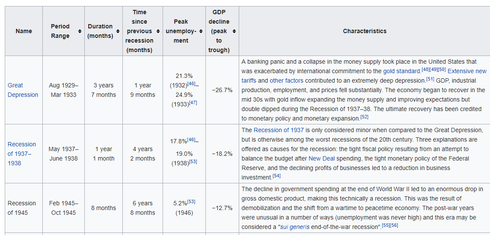

```{r, message=FALSE}

library(tidyverse)
library(rvest)
library(janitor)
library(lubridate)
library(scales)
library(ggalt)
```

## matching e-mail addresses

The example that we will discuss consists of matching an email address. We will work with usual email addresses having one (or a similar variant) of the following forms:

* `somename@email.com`

* `somename99@email.com`

* `some.name@email.com`

* `some.name@an-email.com`

* `some.name@an.email.com`

Since our goal is to match an email address, this implies that we need to define a corresponding regex pattern. If we look at the previous email forms it is possible to see that they have a general structure that can be broken into three parts.

1. username
2. `@`symbol
3. domain name

#### username

The username pattern can be defined as: `^([a-z0-9_\\.-]+)`

The username pattern starts with a caret `^` to indicate the beginning of the string. Then we have a group indicated with parentheses. It matches one or more lowercase letters, numbers, underscores, dots, or hyphens.

####domain name

The domain name pattern can be defined as: `^([\\da-z\\.-]+)\\.([a-z\\.]{2,6})$`

### complete regular expression pattern for an e-mail address in R:

>`^([a-z0-9_\\.-]+)@([\\da-z\\.-]+)\\.([a-z\\.]{2,6})$`

Let's test this:

```{r}
# pattern
email_pat <- "^([a-z0-9_\\.-]+)@([\\da-z\\.-]+)\\.([a-z\\.]{2,6})$"


# single e-mail address 
"gaston@abc.com" %>%
  str_detect(email_pat)


# multiple potential email addresses
emails <- c("simple@example.com", 
            "johnsmith@email.gov",
            "marie.curie@college.edu",
            "very.common@example.com",
            "a.little.lengthy.but.ok@dept.example.com",
            "disposable.style.email.with+symbol@example.com",
            "not_good@email.address")


emails %>%
  str_detect(email_pat)


```

However, if we have a \long" TLD (top-level domain) __exceeding six letters__, our pattern won't match, like in the next example:

```{r}
# unmatched email (TLD too long)
"gaston@abc.something" %>%
  str_detect(email_pat)
```

## cleaning long jump data

In this example we will work with the Men’s Long Jump World Record Progression data from wikipedia

"https://en.wikipedia.org/wiki/Men%27s_long_jump_world_record_progression#Low_altitude_record_progression_1965%E2%80%931991"


```{r}

# extract table to tibble
wiki_jump <-
  'https://en.wikipedia.org/wiki/Men%27s_long_jump_world_record_progression' %>% 
  read_html() %>%
  html_node('table') %>% 
  html_table() 


# colnames to lower
colnames(wiki_jump) <- 
  wiki_jump %>%
  names() %>%
  str_to_lower()

# check
wiki_jump %>%
  glimpse()

```

#### extracting meters

First, we want to extract meters from col 1.

There are two way to do that. First we can take advantage of the uniform length of the mark column elements: they're all length 4 considering just the digits and the dot, thus we use subset the strings

```{r}
wiki_jump %>%
  mutate(mark = str_sub(mark, 1, 6)) %>%
  head()
```

Another, more interesting way to do it is through regex

```{r}
wiki_jump %>%
  mutate(mark = str_extract(mark, "[0-9]\\.[0-9][0-9]")) %>%
  mutate_at(1, as.numeric) %>%  #convert to numeric
  pull(1)
```

#### extracting country

We now want to extract the country for each case in the _athlete_ column.
Again, we can first use the sub_string function

```{r}
wiki_jump %>%
  mutate(country = str_sub(athlete, -4, -2)) %>%
  select(1,2, country) %>%
  pull(3)
```

We now try to use regex

```{r}
wiki_jump %>% 
  mutate(country = str_extract(athlete, "\\(\\w+\\)"),
         country = str_extract(country, "\\w+"),
         athlete = str_remove(athlete, "\\(\\w+\\)")) %>%
  pull(country)
  
```

#### cleaning dates

We start by removing the [1] lement at the end of each date

```{r}
wiki_jump %>%
  select(date) %>%
  mutate(clean_date = str_remove(date, "\\[1\\]")) %>%
  pull(clean_date) %>%
  head()
```

We can now extract year, month and day using regex

```{r}

wiki_jump %>%
  select(date) %>%
  mutate(clean_date = str_remove(date, "\\[1\\]"),
         year = str_extract(clean_date, "\\s[0-9]{4}"),
         month = str_extract(clean_date, "[A-z][a-z]+"),
         day = str_extract(clean_date, "[0-9]+")) %>%
  head()
```

##### all together

```{r}

wiki_jump_cleaned <-
  wiki_jump %>%
  mutate(mark = str_extract(mark, "[0-9]\\.[0-9][0-9]"),
         country = str_extract(athlete, "\\(\\w+\\)"),
         country = str_extract(country, "\\w+"),
         athlete = str_remove(athlete, "\\(\\w+\\)"),
         date = str_remove(date, "\\[1\\]"),
         year = str_extract(date, "\\s[0-9]{4}"),
         month = str_extract(date, "[A-z][a-z]+"),
         day = str_extract(date, "[0-9]+")) %>%
  select(1:3, country, everything(), date)


long_jump_dat <-
  wiki_jump_cleaned %>%
  unite("date", year:day, sep = "-") %>%
  mutate(date = ymd(date)) %>%
  mutate_at(c(1,2), as.numeric) %>%
  mutate_at(4, factor)


# check
long_jump_dat %>%
  sample_n(5)
  
```

## list of recessions in the US

Below is the wikipedia table we want to extract



```{r}
url <- "https://en.wikipedia.org/wiki/List_of_recessions_in_the_United_States"

df3 <- url %>% 
  read_html() %>% 
  html_table() %>% 
  .[[3]] %>% 
  janitor::clean_names()


# fix duration months var
dur_months_sub <-
  df3 %>%
  select(name, duration_months, everything()) %>% 
  mutate(duration_months = substring(duration_months, 3),
         duration_months = str_replace(duration_months, "year[s]?", "year\\s "),
         duration_years = str_extract(duration_months, "[:digit:]\\syears"),
         duration_years = str_extract(duration_years, "[:digit:]"),
         duration_years =  str_replace_na(duration_years, replacement = "0"),
         duration_months = str_remove(duration_months, "[:digit:]\\syears"),
         duration_months = str_remove(duration_months, "month[s]?")) %>%
  select(1,2, duration_years) %>%
  mutate_at(c(2,3), as.numeric) %>% 
  mutate(duration_months = duration_months + duration_years * 12) %>% 
  select(-duration_years)


# fix period range
period_rng_sub <-
  df3 %>%
  select(1,2) %>%
  mutate(period_range = str_replace(period_range, "^[:digit:]+", "" )) %>%
  mutate(period_range = str_extract(period_range,
                                    "[A-Z][a-z]{2,3}\\s[:digit:]+[:punct:][A-Z][a-z]{2,4}\\s[:digit:]+"))


# fix time_since_previous_recession_months
since_prev_sub <-
  df3 %>%
  select(1,4) %>%
  mutate(time_since_previous_recession_months = str_sub(time_since_previous_recession_months, 4)) %>%
  mutate(time_since_years = str_extract(time_since_previous_recession_months, "[:digit:]+\\syear[s]?"),
         time_since_years = str_extract(time_since_years, "[:digit:]+")) %>%
  mutate(time_since_previous_recession_months2 = str_remove(time_since_previous_recession_months,
                                                           "[:digit:]+\\syear[s]?")) %>%
  select(1,2,4, everything()) %>%
  mutate(time_since_previous_recession_months = str_extract(time_since_previous_recession_months2,
                                                            "[:digit:]+"),
         time_since_previous_recession_months = str_replace_na(time_since_previous_recession_months,
                                                               replacement = "0"),
         time_since_previous_recession_months = as.numeric(time_since_previous_recession_months),
         time_since_years = as.numeric(time_since_years),
         time_since_previous_recession_months = time_since_years * 12 + time_since_previous_recession_months) %>%
  select(1,2)
         


# fix gdp_decline_peak_...
gdp_delc_sub <-
  df3 %>%
  select(1, gdp_decline_peak_to_trough) %>%
  mutate(gdp_decline_peak_to_trough = str_remove(gdp_decline_peak_to_trough, "[:digit:]+\\.[:digit:]"),
         gdp_decline_peak_to_trough = str_remove(gdp_decline_peak_to_trough, "\\%"),
         gdp_decline_peak_to_trough = str_replace(gdp_decline_peak_to_trough, "\\[\\d{2}\\]", ""),
         gdp_decline_peak_to_trough = str_extract(gdp_decline_peak_to_trough, "[:digit:]+\\.[:digit:]")) %>%
  mutate_at(2, as.numeric) %>%
  mutate_at(2, ~. * -1/100)


# all together
recession_dat <-
  dur_months_sub %>%
  left_join(period_rng_sub) %>%
  left_join(since_prev_sub) %>%
  left_join(gdp_delc_sub) %>% 
  select(1,3,2,4,5) 


# check
recession_dat %>%
  select(1,2,3) %>%
  sample_n(4)


recession_dat %>%
  select(4,5) %>%
  sample_n(4)
  

```


