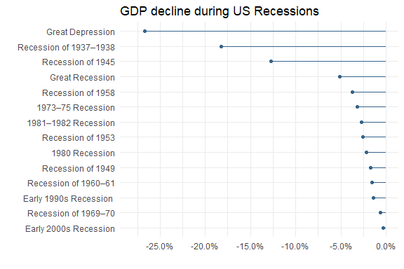

cases two
================
DanielH
April 9, 2019

  - [matching e-mail addresses](#matching-e-mail-addresses)
  - [cleaning long jump data](#cleaning-long-jump-data)
  - [list of recessions in the US](#list-of-recessions-in-the-us)

``` r
library(tidyverse)
library(rvest)
library(janitor)
library(lubridate)
library(scales)
library(ggalt)
library(knitr)
library(kableExtra)
```

## matching e-mail addresses

The example that we will discuss consists of matching an email address.
We will work with usual email addresses having one (or a similar
variant) of the following forms:

  - `somename@email.com`

  - `somename99@email.com`

  - `some.name@email.com`

  - `some.name@an-email.com`

  - `some.name@an.email.com`

Since our goal is to match an email address, this implies that we need
to define a corresponding regex pattern. If we look at the previous
email forms it is possible to see that they have a general structure
that can be broken into three parts.

1.  username
2.  `@`symbol
3.  domain name

#### username

The username pattern can be defined as: `^([a-z0-9_\\.-]+)`

The username pattern starts with a caret `^` to indicate the beginning
of the string. Then we have a group indicated with parentheses. It
matches one or more lowercase letters, numbers, underscores, dots, or
hyphens.

\#\#\#\#domain name

The domain name pattern can be defined as:
`^([\\da-z\\.-]+)\\.([a-z\\.]{2,6})$`

### complete regular expression pattern for an e-mail address in R:

> `^([a-z0-9_\\.-]+)@([\\da-z\\.-]+)\\.([a-z\\.]{2,6})$`

Let’s test this:

``` r
# pattern
email_pat <- "^([a-z0-9_\\.-]+)@([\\da-z\\.-]+)\\.([a-z\\.]{2,6})$"


# single e-mail address 
"gaston@abc.com" %>%
  str_detect(email_pat)
```

    ## [1] TRUE

``` r
# multiple potential email addresses
emails <- c("simple@example.com", 
            "johnsmith@email.gov",
            "marie.curie@college.edu",
            "very.common@example.com",
            "a.little.lengthy.but.ok@dept.example.com",
            "disposable.style.email.with+symbol@example.com",
            "not_good@email.address")


emails %>%
  str_detect(email_pat)
```

    ## [1]  TRUE  TRUE  TRUE  TRUE  TRUE FALSE FALSE

However, if we have a " TLD (top-level domain) **exceeding six
letters**, our pattern won’t match, like in the next example:

``` r
# unmatched email (TLD too long)
"gaston@abc.something" %>%
  str_detect(email_pat)
```

    ## [1] FALSE

## cleaning long jump data

In this example we will work with the Men’s Long Jump World Record
Progression data from
wikipedia

“<https://en.wikipedia.org/wiki/Men%27s_long_jump_world_record_progression#Low_altitude_record_progression_1965%E2%80%931991>”


``` r
# extract table to tibble
wiki_jump <-
  'https://en.wikipedia.org/wiki/Men%27s_long_jump_world_record_progression' %>% 
  read_html() %>%
  html_node('table') %>% 
  html_table() 


# colnames to lower
colnames(wiki_jump) <- 
  wiki_jump %>%
  names() %>%
  str_to_lower()

# check
wiki_jump %>%
  glimpse()
```

    ## Observations: 18
    ## Variables: 5
    ## $ mark    <chr> "7.61 m (24 ft 11 1/2 in)", "7.69 m (25 ft 2 3/4 in)",...
    ## $ wind    <dbl> NA, NA, NA, NA, NA, 0.0, 0.5, 1.5, 0.0, 1.8, 1.2, -0.1...
    ## $ athlete <chr> "Peter O'Connor (IRE)", "Edward Gourdin (USA)", "Rober...
    ## $ venue   <chr> "Dublin, Ireland", "Cambridge, United States", "Paris,...
    ## $ date    <chr> "5 August 1901[1]", "23 July 1921[1]", "7 July 1924[1]...

#### extracting meters

First, we want to extract meters from col 1.

There are two way to do that. First we can take advantage of the uniform
length of the mark column elements: they’re all length 4 considering
just the digits and the dot, thus we use subset the strings

``` r
wiki_jump %>%
  mutate(mark = str_sub(mark, 1, 6)) %>%
  head()
```

    ##     mark wind               athlete                    venue
    ## 1 7.61 m   NA  Peter O'Connor (IRE)          Dublin, Ireland
    ## 2 7.69 m   NA  Edward Gourdin (USA) Cambridge, United States
    ## 3 7.76 m   NA Robert LeGendre (USA)            Paris, France
    ## 4 7.89 m   NA  DeHart Hubbard (USA)   Chicago, United States
    ## 5 7.90 m   NA     Edward Hamm (USA) Cambridge, United States
    ## 6 7.93 m    0    Sylvio Cator (HAI)            Paris, France
    ##                  date
    ## 1    5 August 1901[1]
    ## 2     23 July 1921[1]
    ## 3      7 July 1924[1]
    ## 4     13 June 1925[1]
    ## 5      7 July 1928[1]
    ## 6 9 September 1928[1]

Another, more interesting way to do it is through regex

``` r
wiki_jump %>%
  mutate(mark = str_extract(mark, "[0-9]\\.[0-9][0-9]")) %>%
  mutate_at(1, as.numeric) %>%  #convert to numeric
  pull(1)
```

    ##  [1] 7.61 7.69 7.76 7.89 7.90 7.93 7.98 8.13 8.21 8.24 8.28 8.31 8.31 8.34
    ## [15] 8.35 8.35 8.90 8.95

#### extracting country

We now want to extract the country for each case in the *athlete*
column. Again, we can first use the sub\_string function

``` r
wiki_jump %>%
  mutate(country = str_sub(athlete, -4, -2)) %>%
  select(1,2, country) %>%
  pull(3)
```

    ##  [1] "IRE" "USA" "USA" "USA" "USA" "HAI" "JPN" "USA" "USA" "USA" "USA"
    ## [12] "URS" "USA" "USA" "USA" "URS" "USA" "USA"

We now try to use regex

``` r
wiki_jump %>% 
  mutate(country = str_extract(athlete, "\\(\\w+\\)"),
         country = str_extract(country, "\\w+"),
         athlete = str_remove(athlete, "\\(\\w+\\)")) %>%
  pull(country)
```

    ##  [1] "IRE" "USA" "USA" "USA" "USA" "HAI" "JPN" "USA" "USA" "USA" "USA"
    ## [12] "URS" "USA" "USA" "USA" "URS" "USA" "USA"

#### cleaning dates

We start by removing the \[1\] lement at the end of each date

``` r
wiki_jump %>%
  select(date) %>%
  mutate(clean_date = str_remove(date, "\\[1\\]")) %>%
  pull(clean_date) %>%
  head()
```

    ## [1] "5 August 1901"    "23 July 1921"     "7 July 1924"     
    ## [4] "13 June 1925"     "7 July 1928"      "9 September 1928"

We can now extract year, month and day using regex

``` r
wiki_jump %>%
  select(date) %>%
  mutate(clean_date = str_remove(date, "\\[1\\]"),
         year = str_extract(clean_date, "\\s[0-9]{4}"),
         month = str_extract(clean_date, "[A-z][a-z]+"),
         day = str_extract(clean_date, "[0-9]+")) %>%
  head()
```

    ##                  date       clean_date  year     month day
    ## 1    5 August 1901[1]    5 August 1901  1901    August   5
    ## 2     23 July 1921[1]     23 July 1921  1921      July  23
    ## 3      7 July 1924[1]      7 July 1924  1924      July   7
    ## 4     13 June 1925[1]     13 June 1925  1925      June  13
    ## 5      7 July 1928[1]      7 July 1928  1928      July   7
    ## 6 9 September 1928[1] 9 September 1928  1928 September   9

##### all together

``` r
wiki_jump_cleaned <-
  wiki_jump %>%
  mutate(mark = str_extract(mark, "[0-9]\\.[0-9][0-9]"),
         country = str_extract(athlete, "\\(\\w+\\)"),
         country = str_extract(country, "\\w+"),
         athlete = str_remove(athlete, "\\(\\w+\\)"),
         date = str_remove(date, "\\[1\\]"),
         year = str_extract(date, "\\s[0-9]{4}"),
         month = str_extract(date, "[A-z][a-z]+"),
         day = str_extract(date, "[0-9]+")) %>%
  select(1:3, country, everything(), date)


long_jump_dat <-
  wiki_jump_cleaned %>%
  unite("date", year:day, sep = "-") %>%
  mutate(date = ymd(date)) %>%
  mutate_at(c(1,2), as.numeric) %>%
  mutate_at(4, factor)


# check
long_jump_dat %>%
  sample_n(5)
```

    ##   mark wind         athlete country                      venue       date
    ## 1 7.69   NA Edward Gourdin      USA   Cambridge, United States 1921-07-23
    ## 2 7.90   NA    Edward Hamm      USA   Cambridge, United States 1928-07-07
    ## 3 7.93    0   Sylvio Cator      HAI              Paris, France 1928-09-09
    ## 4 8.34    1   Ralph Boston      USA Los Angeles, United States 1964-09-12
    ## 5 8.35    0   Ralph Boston      USA     Modesto, United States 1965-05-29

## list of recessions in the US

Below is the wikipedia table we want to
extract


``` r
url <- "https://en.wikipedia.org/wiki/List_of_recessions_in_the_United_States"

df3 <- url %>% 
  read_html() %>% 
  html_table() %>% 
  .[[3]] %>% 
  janitor::clean_names()


# check raw data
df3 %>%
  select(1:3) %>% 
  head(3) %>%
  kable()
```

<table>

<thead>

<tr>

<th style="text-align:left;">

name

</th>

<th style="text-align:left;">

period\_range

</th>

<th style="text-align:left;">

duration\_months

</th>

</tr>

</thead>

<tbody>

<tr>

<td style="text-align:left;">

Great Depression

</td>

<td style="text-align:left;">

Aug 1929–Mar 1933Oct 1929–Dec 1941

</td>

<td style="text-align:left;">

433 years7 months

</td>

</tr>

<tr>

<td style="text-align:left;">

Recession of 1937–1938

</td>

<td style="text-align:left;">

1937May 1937–June 1938

</td>

<td style="text-align:left;">

131 year1 month

</td>

</tr>

<tr>

<td style="text-align:left;">

Recession of 1945

</td>

<td style="text-align:left;">

1945Feb 1945–Oct 1945

</td>

<td style="text-align:left;">

088 months

</td>

</tr>

</tbody>

</table>

``` r
df3 %>%
  select(4,6) %>%
  head(3) %>%
  kable()
```

<table>

<thead>

<tr>

<th style="text-align:left;">

time\_since\_previous\_recession\_months

</th>

<th style="text-align:left;">

gdp\_decline\_peak\_to\_trough

</th>

</tr>

</thead>

<tbody>

<tr>

<td style="text-align:left;">

0211 year9 months

</td>

<td style="text-align:left;">

26.7−26.7%

</td>

</tr>

<tr>

<td style="text-align:left;">

0504 years2 months

</td>

<td style="text-align:left;">

03.4−18.2%

</td>

</tr>

<tr>

<td style="text-align:left;">

0806 years8 months

</td>

<td style="text-align:left;">

12.7−12.7%

</td>

</tr>

</tbody>

</table>

#### data cleaning

``` r
# fix duration months var
dur_months_sub <-
  df3 %>%
  select(name, duration_months, everything()) %>% 
  mutate(duration_months = substring(duration_months, 3),
         duration_months = str_replace(duration_months, "year[s]?", "year\\s "),
         duration_years = str_extract(duration_months, "[:digit:]\\syears"),
         duration_years = str_extract(duration_years, "[:digit:]"),
         duration_years =  str_replace_na(duration_years, replacement = "0"),
         duration_months = str_remove(duration_months, "[:digit:]\\syears"),
         duration_months = str_remove(duration_months, "month[s]?")) %>%
  select(1,2, duration_years) %>%
  mutate_at(c(2,3), as.numeric) %>% 
  mutate(duration_months = duration_months + duration_years * 12) %>% 
  select(-duration_years)


# fix period range
period_rng_sub <-
  df3 %>%
  select(1,2) %>%
  mutate(period_range = str_replace(period_range, "^[:digit:]+", "" )) %>%
  mutate(period_range = str_extract(period_range,
                                    "[A-Z][a-z]{2,3}\\s[:digit:]+[:punct:][A-Z][a-z]{2,4}\\s[:digit:]+"))


# fix time_since_previous_recession_months
since_prev_sub <-
  df3 %>%
  select(1,4) %>%
  mutate(time_since_previous_recession_months = str_sub(time_since_previous_recession_months, 4)) %>%
  mutate(time_since_years = str_extract(time_since_previous_recession_months, "[:digit:]+\\syear[s]?"),
         time_since_years = str_extract(time_since_years, "[:digit:]+")) %>%
  mutate(time_since_previous_recession_months2 = str_remove(time_since_previous_recession_months,
                                                           "[:digit:]+\\syear[s]?")) %>%
  select(1,2,4, everything()) %>%
  mutate(time_since_previous_recession_months = str_extract(time_since_previous_recession_months2,
                                                            "[:digit:]+"),
         time_since_previous_recession_months = str_replace_na(time_since_previous_recession_months,
                                                               replacement = "0"),
         time_since_previous_recession_months = as.numeric(time_since_previous_recession_months),
         time_since_years = as.numeric(time_since_years),
         time_since_previous_recession_months = time_since_years * 12 + time_since_previous_recession_months) %>%
  select(1,2)
         


# fix gdp_decline_peak_...
gdp_delc_sub <-
  df3 %>%
  select(1, gdp_decline_peak_to_trough) %>%
  mutate(gdp_decline_peak_to_trough = str_remove(gdp_decline_peak_to_trough, "[:digit:]+\\.[:digit:]"),
         gdp_decline_peak_to_trough = str_remove(gdp_decline_peak_to_trough, "\\%"),
         gdp_decline_peak_to_trough = str_replace(gdp_decline_peak_to_trough, "\\[\\d{2}\\]", ""),
         gdp_decline_peak_to_trough = str_extract(gdp_decline_peak_to_trough, "[:digit:]+\\.[:digit:]")) %>%
  mutate_at(2, as.numeric) %>%
  mutate_at(2, ~. * -1/100)


# all together
recession_dat <-
  dur_months_sub %>%
  left_join(period_rng_sub) %>%
  left_join(since_prev_sub) %>%
  left_join(gdp_delc_sub) %>% 
  select(1,3,2,4,5) 
```

    ## Joining, by = "name"
    ## Joining, by = "name"
    ## Joining, by = "name"

``` r
# check
recession_dat %>%
  select(1,2,3) %>%
  head(3) %>%
  kable()
```

<table>

<thead>

<tr>

<th style="text-align:left;">

name

</th>

<th style="text-align:left;">

period\_range

</th>

<th style="text-align:right;">

duration\_months

</th>

</tr>

</thead>

<tbody>

<tr>

<td style="text-align:left;">

Great Depression

</td>

<td style="text-align:left;">

Aug 1929–Mar 1933

</td>

<td style="text-align:right;">

43

</td>

</tr>

<tr>

<td style="text-align:left;">

Recession of 1937–1938

</td>

<td style="text-align:left;">

May 1937–June 1938

</td>

<td style="text-align:right;">

13

</td>

</tr>

<tr>

<td style="text-align:left;">

Recession of 1945

</td>

<td style="text-align:left;">

Feb 1945–Oct 1945

</td>

<td style="text-align:right;">

8

</td>

</tr>

</tbody>

</table>

``` r
recession_dat %>%
  select(4,5) %>%
  head(3) %>%
  kable()
```

<table>

<thead>

<tr>

<th style="text-align:right;">

time\_since\_previous\_recession\_months

</th>

<th style="text-align:right;">

gdp\_decline\_peak\_to\_trough

</th>

</tr>

</thead>

<tbody>

<tr>

<td style="text-align:right;">

21

</td>

<td style="text-align:right;">

\-0.267

</td>

</tr>

<tr>

<td style="text-align:right;">

50

</td>

<td style="text-align:right;">

\-0.182

</td>

</tr>

<tr>

<td style="text-align:right;">

80

</td>

<td style="text-align:right;">

\-0.127

</td>

</tr>

</tbody>

</table>

#### some plots

``` r
# shorten the name of the early 90's recession
recession_dat2 <-
  recession_dat %>%
  mutate(name = str_replace(name, "in the United States", ""),
         name = str_replace(name, "recession", "Recession"))


# length of recessions
recession_dat2 %>%
  arrange(desc(duration_months)) %>%
  ggplot(aes(fct_reorder(name, duration_months), duration_months)) +
  geom_lollipop(color = "steelblue3", size = .6) +
  scale_y_continuous(limits = c(0,45),
                     breaks = seq.int(0,45,5)) +
  coord_flip() +
  labs(title = "Length of Recessions in the US, months",
       x = "", y = "") +
  theme_minimal()
```


``` r
# by gdp decline
recession_dat2 %>%
  arrange(gdp_decline_peak_to_trough) %>%
  ggplot(aes(fct_reorder(name, -gdp_decline_peak_to_trough), gdp_decline_peak_to_trough)) +
  geom_lollipop(color = "steelblue4", size = .6) +
  scale_y_continuous(limits = c(-0.28, 0),
                     breaks = seq.int(-0.25, 0, 0.05),
                     labels = percent_format()) +
  coord_flip() +
  theme_minimal() +
  labs(title = "GDP decline during US Recessions",
       x = "", y = "")
```



``` r
# by time since previous recession
recession_dat2 %>%
  arrange(desc(time_since_previous_recession_months)) %>%
  ggplot(aes(fct_reorder(name, time_since_previous_recession_months), time_since_previous_recession_months)) +
  geom_lollipop(color = "chocolate", size = .6) +
  scale_y_continuous(limits = c(0,130),
                     breaks = seq.int(0, 120, 10)) +
  coord_flip() +
  theme_minimal() +
  labs(title = "Months since previous Recession",
       x = "", y = "")
```


