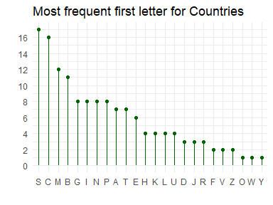
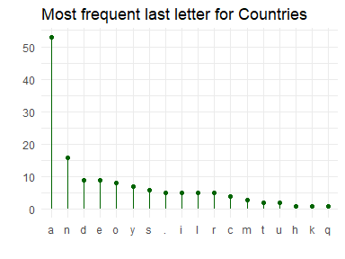
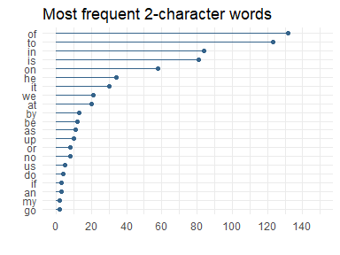
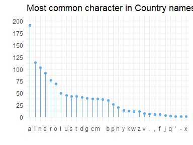
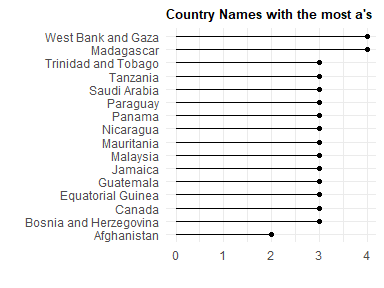

stringr practice
================
DanielH
April 13, 2019

-   [part 1](#part-1)
-   [part 2](#part-2)
-   [part 3](#part-3)

``` r
library(tidyverse)
library(ggalt)
library(babynames)
```

------------------------------------------------------------------------

part 1
------

<https://www.r-exercises.com/2017/07/14/hacking-strings-with-stringr/>

### exercise 001

> use a stringr function to merge these 3 strings.

`x <- "I AM SAM. I AM SAM. SAM I AM"`

`y <- "THAT SAM-I-AM! THAT SAM-I-AM! I DO NOT LIKE THAT SAM-I-AM!"`

`z <- "DO WOULD YOU LIKE GREEN EGGS AND HAM?"`

``` r
x <- "I AM SAM. I AM SAM. SAM I AM"
y <- "THAT SAM-I-AM! THAT SAM-I-AM! I DO NOT LIKE THAT SAM-I-AM!"
z <- "DO WOULD YOU LIKE GREEN EGGS AND HAM?"

str_c(x,y,z, collapse = " ")
```

    ## [1] "I AM SAM. I AM SAM. SAM I AMTHAT SAM-I-AM! THAT SAM-I-AM! I DO NOT LIKE THAT SAM-I-AM!DO WOULD YOU LIKE GREEN EGGS AND HAM?"

### exercise 002

> Now use a vector which contains x,y,z and NA and make it a single sentence using paste ,do the same by the same function you used for exercise1 .Can you spot the difference .

``` r
paste(c(x, y, z, NA),collapse = ". ")
```

    ## [1] "I AM SAM. I AM SAM. SAM I AM. THAT SAM-I-AM! THAT SAM-I-AM! I DO NOT LIKE THAT SAM-I-AM!. DO WOULD YOU LIKE GREEN EGGS AND HAM?. NA"

``` r
str_c(c(x, y ,z ,NA),collapse = ". ")
```

    ## [1] NA

### exercise 003

> Install the babynames dataset, find the vector of length of the babynames using stringr functions. You may wonder nchar can do the same so why not use that. Try finding out the difference

``` r
(babynames %>%
  pull(name) %>%
  str_length()) %>%
  identical(babynames %>%
              pull(name) %>%
              nchar())
```

    ## [1] TRUE

### exercise 004

> Create a string name with your name. Use str\_sub to get the last character and the last 5 characters.

``` r
# last character
"Daniel" %>%
  str_sub(-1)
```

    ## [1] "l"

``` r
# last 5 characters
"Daniel" %>%
  str_sub(-5)
```

    ## [1] "aniel"

### exercise 005

> In the mtcars dataset rownames, find all cars of the brand Merc

``` r
mtcars %>% 
  as_tibble(rownames = "brands") %>%  # new col rownames
  filter(str_detect(brands, "Merc")) %>%
  pull(1)
```

    ## [1] "Merc 240D"   "Merc 230"    "Merc 280"    "Merc 280C"   "Merc 450SE" 
    ## [6] "Merc 450SL"  "Merc 450SLC"

### exercise 006

> Use the same mtcars rownames ,find the total number of times “e” appears in that

``` r
mtcars %>% 
  as_tibble(rownames = "brands") %>%  # new col rownames
  pull(1) %>% 
  str_count("e") %>%
  sum()
```

    ## [1] 25

### exercise 007

> Suppose you have a string like this `j <- "The_quick_brown_fox_jumps_over_the_lazy_dog"` split it in words using a stringr function

``` r
j <- "The_quick_brown_fox_jumps_over_the_lazy_dog"


j %>%
  str_split("_") %>%  # returns a list
  flatten_chr()  # to vector
```

    ## [1] "The"   "quick" "brown" "fox"   "jumps" "over"  "the"   "lazy"  "dog"

### exercise 008

> On the same string we need the first word splitted but the rest intact

``` r
j %>%
  str_split("_", n = 2) %>%
  flatten_chr()
```

    ## [1] "The"                                    
    ## [2] "quick_brown_fox_jumps_over_the_lazy_dog"

> on the same string we want the first “*” replaced by “–” and then all the “*” replaced by “–”

``` r
j %>% 
  str_replace("_", "-")
```

    ## [1] "The-quick_brown_fox_jumps_over_the_lazy_dog"

``` r
j %>%
  str_replace_all("_", "-")
```

    ## [1] "The-quick-brown-fox-jumps-over-the-lazy-dog"

na\_string\_vec &lt;- c(“The\_quick\_brown\_fox\_jumps\_over\_the\_lazy\_dog”,NA)

``` r
na_string_vec <- c("The_quick_brown_fox_jumps_over_the_lazy_dog", NA)


na_string_vec %>%
  str_replace_na()
```

    ## [1] "The_quick_brown_fox_jumps_over_the_lazy_dog"
    ## [2] "NA"

------------------------------------------------------------------------

part 2
------

<https://www.r-exercises.com/2018/01/22/stringr-basic-functions-exercises/>

### exercise 01

> For a warm up, make a new dataframe based on the gapminder data with one row per country and two columns, country and continent. Name it simply df

``` r
library(gapminder)

gapminder <-
  gapminder %>%
  as_tibble()


df <-
  gapminder %>%
  select(1:2) %>%
  distinct(country, .keep_all = T)

df %>%
  head(5)
```

    ## # A tibble: 5 x 2
    ##   country     continent
    ##   <fct>       <fct>    
    ## 1 Afghanistan Asia     
    ## 2 Albania     Europe   
    ## 3 Algeria     Africa   
    ## 4 Angola      Africa   
    ## 5 Argentina   Americas

### exercise 02

> Use a stringr function to find out what the average length of the country names are, as they appear in the data-set.

``` r
df %>%
  select(2, everything()) %>% 
  mutate(nm_length = str_length(country)) %>%
  summarize(avg_length = mean(nm_length, na.rm = T)) %>%
  map_dbl(round, 3)
```

    ## avg_length 
    ##      8.352

### exercise 03

Extract the first and last letter of each country’s name. Make a frequency plot for both. Here you can use base-R function table.

``` r
# create 'first' and 'last' vars
df_modified <-
  df %>%
  mutate(first = str_sub(country, 0, 1),
         last = str_sub(country, -1)) %>%
  select(continent, everything())

# plot first letter
df_modified %>%
  count(first, sort = T) %>%
  ggplot(aes(fct_reorder(first, -n), n)) +
  geom_lollipop(color = "darkgreen") +
  scale_y_continuous(breaks = seq.int(0,16,2)) +
  labs(title = "Most frequent first letter for Countries",
       x = "", y = "") +
  theme_minimal()
```



``` r
# plot last letter
df_modified %>%
  count(last, sort = T) %>%
  ggplot(aes(fct_reorder(last, -n), n)) +
  geom_lollipop(color = "darkgreen", size = .5, point.size = 1.6) +
  scale_y_continuous(breaks = seq.int(0,50,10)) +
  labs(title = "Most frequent last letter for Countries",
       x = "", y = "") +
  theme_minimal()
```



I could use that plot with balls nad few values

### exercise 04

> What countries have the word “and” as part of their name?

``` r
df %>%
  filter(str_detect(country, " and "))
```

    ## # A tibble: 4 x 2
    ##   country                continent
    ##   <fct>                  <fct>    
    ## 1 Bosnia and Herzegovina Europe   
    ## 2 Sao Tome and Principe  Africa   
    ## 3 Trinidad and Tobago    Americas 
    ## 4 West Bank and Gaza     Asia

### exercise 05

> Delete all instances of "," and "." from the country names.

``` r
# check occurencies
df %>%
  filter(str_detect(country, ("\\.")))
```

    ## # A tibble: 5 x 2
    ##   country          continent
    ##   <fct>            <fct>    
    ## 1 Congo, Dem. Rep. Africa   
    ## 2 Congo, Rep.      Africa   
    ## 3 Korea, Dem. Rep. Asia     
    ## 4 Korea, Rep.      Asia     
    ## 5 Yemen, Rep.      Asia

``` r
# solution
df %>%
  mutate(country = str_replace_all(country, "\\,|\\.", " ")) %>%
  filter(str_detect(country, ("Congo|Korea|Yemen")))
```

    ## # A tibble: 5 x 2
    ##   country            continent
    ##   <chr>              <fct>    
    ## 1 "Congo  Dem  Rep " Africa   
    ## 2 "Congo  Rep "      Africa   
    ## 3 "Korea  Dem  Rep " Asia     
    ## 4 "Korea  Rep "      Asia     
    ## 5 "Yemen  Rep "      Asia

### exercise 06

> Use `str_dup` and `str_c` to generate the vector `c("mouse likes cat very much", "mouse likes cat very very much", "mouse likes cat very very very much")` .

``` r
# solution
str_c("mouse likes cat ",  str_dup("very ", 1:3), "much")
```

    ## [1] "mouse likes cat very much"          
    ## [2] "mouse likes cat very very much"     
    ## [3] "mouse likes cat very very very much"

``` r
# solution with piping  
str_dup("very ", 1:3) %>%
  str_c("mouse likes cat ",  ., "much")
```

    ## [1] "mouse likes cat very much"          
    ## [2] "mouse likes cat very very much"     
    ## [3] "mouse likes cat very very very much"

### exercise 07

Imagine you are creating an app to explore the Gapminder data; the tool you are using can only accommodate country names of 12 characters. Therefore, you decide to shorten the names from the right, such that if the country name is longer than 12 characters, you trim it to 11 and add a full stop.

``` r
# using str_trunc()
dat1 <-
  df %>%
  mutate_at(1, as.character) %>% 
  mutate(trunc_w_1 = str_trunc(country, 11, ellipsis = ".")) 


# alternative approach
dat2 <-
  df %>%
  select(-2) %>% 
  mutate_at(1, as.character) %>%
  mutate(nchar= nchar(country),
         trunc_w_2 = if_else(nchar > 12, str_trunc(country, 11, ellipsis = "."),
                           country))


# check some truncated country names
vector_one <-
  dat2 %>%
  filter(str_detect(country, "Central|Bosnia|Trinid|Domin")) %>%
  pull(3)


vector_two <-
  dat1 %>%
   filter(str_detect(country, "Central|Bosnia|Trinid|Domin")) %>%
  pull(3)

# verify results are identical
vector_one %>% identical(vector_two)
```

    ## [1] TRUE

### exercise 08

> sentences is a character vector of 720 sentences that loads to your environment when you load the stringr package. Extract all two-character words from it and plot their frequency.

``` r
# extract 2-char words
two_char_words <-
  sentences %>% 
  str_to_lower() %>%
  str_split(" ") %>%  # split string into words
  flatten_chr() %>%
  keep(~str_length(.x) == 2) %>%
  enframe(" ", "two_chr") %>%
  count(two_chr, sort = T) %>%
  filter(!two_chr %in% c("ii", "st", "so"))
  

# plot
two_char_words %>%
  ggplot(aes(fct_reorder(two_chr, n), n)) +
  geom_lollipop(color = "steelblue4") +
  scale_y_continuous(limits = c(0, 150),
                     breaks = seq.int(0, 140, 20)) +
  coord_flip() +
  labs(title = "Most frequent 2-character words",
       x = "", y = "") +
  theme_minimal()
```



### exercise 09

> Convert the names to lower case and count what characters are the most common in the country names overall.

``` r
chr_tab_df <-
  df %>%
  pull(country) %>%
  str_to_lower() %>%
  str_c(collapse = "") %>%
  str_split("") %>%
  as_tibble(.name_repair = "minimal") %>%
  rename("character" = 1) %>%
  count(character, sort = T)


# plot
chr_tab_df %>%
  ggplot(aes(fct_reorder(character, -n), n)) +
  geom_lollipop(color = "steelblue2") +
  scale_y_continuous(limits = c(0, 200),
                     breaks = seq.int(0, 200, 25)) +
  labs(title = "Most common character in Country names",
       x = "", y = "") +
  theme_minimal()
```



### exercise 010

> “A” is the most used character. What is the country that takes this the furthest and has the most “a”s in its name?

``` r
df %>%
  select(2,1) %>% 
  mutate(tot_a = str_count(country, "a")) %>%
  arrange(desc(tot_a)) %>%
  head(16) %>% 
  ggplot(aes(fct_reorder(country, tot_a), tot_a)) +
  geom_lollipop() +
  #geom_bar(stat = "identity") +
  coord_flip() +
  theme_minimal() +
  theme(plot.title = element_text(size = 10,
                                  face = "bold")) +
  labs(title = "Country Names with the most a's",
       x = "", y = "") 
```



------------------------------------------------------------------------

part 3
------

<https://www.r-exercises.com/2018/10/01/pull-the-right-strings-with-stringr-solutions/>

### data

``` r
addresses <- 
  c("14 Pine Street, Los Angeles", "152 Redwood Street, Seattle", 
    "8 Washington Boulevard, New York")

products <- 
  c("TV ", " laptop", "portable charger", "Wireless Keybord" , " HeadPhones " )

long_sentences <- 
  stringr::sentences[1:10]

field_names <-
  c("order_number", "order_date", "customer_email",
    "product_title", "amount")

employee_skills <-
  c("John Bale (Beginner)", "Rita Murphy (Pro)",
    "Chris White (Pro)", "Sarah Reid (Medium)")


addresses
```

    ## [1] "14 Pine Street, Los Angeles"      "152 Redwood Street, Seattle"     
    ## [3] "8 Washington Boulevard, New York"

``` r
products
```

    ## [1] "TV "              " laptop"          "portable charger"
    ## [4] "Wireless Keybord" " HeadPhones "

``` r
long_sentences
```

    ##  [1] "The birch canoe slid on the smooth planks." 
    ##  [2] "Glue the sheet to the dark blue background."
    ##  [3] "It's easy to tell the depth of a well."     
    ##  [4] "These days a chicken leg is a rare dish."   
    ##  [5] "Rice is often served in round bowls."       
    ##  [6] "The juice of lemons makes fine punch."      
    ##  [7] "The box was thrown beside the parked truck."
    ##  [8] "The hogs were fed chopped corn and garbage."
    ##  [9] "Four hours of steady work faced us."        
    ## [10] "Large size in stockings is hard to sell."

``` r
field_names
```

    ## [1] "order_number"   "order_date"     "customer_email" "product_title" 
    ## [5] "amount"

``` r
employee_skills
```

    ## [1] "John Bale (Beginner)" "Rita Murphy (Pro)"    "Chris White (Pro)"   
    ## [4] "Sarah Reid (Medium)"

### exercise 1

> Normalize the addresses vector by replacing capitalized letters with lower-case ones.

``` r
addresses %>%
  str_to_lower()
```

    ## [1] "14 pine street, los angeles"      "152 redwood street, seattle"     
    ## [3] "8 washington boulevard, new york"

### exercise 2

> Pull only the numeric part of the addresses vector.

``` r
addresses %>%
  str_extract_all("[:digit:]+")
```

    ## [[1]]
    ## [1] "14"
    ## 
    ## [[2]]
    ## [1] "152"
    ## 
    ## [[3]]
    ## [1] "8"

``` r
# also
addresses %>%
  str_extract_all("[:digit:]{1,3}") %>%  # this is the answer
  modify_depth(1, as.numeric) %>%   # to numeric
  as_vector()  # as a numeric vector
```

    ## [1]  14 152   8

### exercise 3

> Split the addresses vector into two parts: address and city. The result should be a matrix.

``` r
addresses %>%
  str_remove("[:digit:]{1,3}") %>%
  str_trim() %>%
  str_split(",", simplify = T)
```

    ##      [,1]                   [,2]          
    ## [1,] "Pine Street"          " Los Angeles"
    ## [2,] "Redwood Street"       " Seattle"    
    ## [3,] "Washington Boulevard" " New York"

### exercise 4

> Now try to split the addresses vector into three parts: house number, street and city. The result should be a matrix.

*Hint: use a regex lookbehind assertion*

``` r
addresses %>%
  str_split("(?<=[:digit:]) |, ",  simplify = T) 
```

    ##      [,1]  [,2]                   [,3]         
    ## [1,] "14"  "Pine Street"          "Los Angeles"
    ## [2,] "152" "Redwood Street"       "Seattle"    
    ## [3,] "8"   "Washington Boulevard" "New York"

### exercise 5

> In the long\_sentences vector, for sentences that start with the letter “T” or end with the letter “s”, show the first or last word respectively. If the sentence both starts with a “T” and ends with an “s”, show both the first and the last words. Remember that the actual last character of a sentence is usually a period.

``` r
long_sentences %>% str_extract_all("^T[A-z]+|[A-z]+s\\.$")
```

    ## [[1]]
    ## [1] "The"     "planks."
    ## 
    ## [[2]]
    ## character(0)
    ## 
    ## [[3]]
    ## character(0)
    ## 
    ## [[4]]
    ## [1] "These"
    ## 
    ## [[5]]
    ## [1] "bowls."
    ## 
    ## [[6]]
    ## [1] "The"
    ## 
    ## [[7]]
    ## [1] "The"
    ## 
    ## [[8]]
    ## [1] "The"
    ## 
    ## [[9]]
    ## [1] "us."
    ## 
    ## [[10]]
    ## character(0)

### exercise 6

> Show only the first 20 characters of all sentences in the long\_sentences vector. To indicate that you removed some characters, use two consecutive periods at the end of each sentence.

``` r
long_sentences %>%
  str_trunc(22, ellipsis = "..") 
```

    ##  [1] "The birch canoe slid.." "Glue the sheet to th.."
    ##  [3] "It's easy to tell th.." "These days a chicken.."
    ##  [5] "Rice is often served.." "The juice of lemons .."
    ##  [7] "The box was thrown b.." "The hogs were fed ch.."
    ##  [9] "Four hours of steady.." "Large size in stocki.."

``` r
# without specifying the ellipsis (3 by default)
long_sentences %>%
  str_trunc(23) %>%
  str_replace_all("\\.+", "\\.\\.")
```

    ##  [1] "The birch canoe slid.." "Glue the sheet to th.."
    ##  [3] "It's easy to tell th.." "These days a chicken.."
    ##  [5] "Rice is often served.." "The juice of lemons .."
    ##  [7] "The box was thrown b.." "The hogs were fed ch.."
    ##  [9] "Four hours of steady.." "Large size in stocki.."

### exercise 7

> Normalize the products vector by removing all unnecessary whitespaces (both from the start, the end and the middle), and by capitalizing all letters

``` r
products %>%
  str_trim() %>%
  str_to_upper()
```

    ## [1] "TV"               "LAPTOP"           "PORTABLE CHARGER"
    ## [4] "WIRELESS KEYBORD" "HEADPHONES"

-   `str_trim()` removes whitespace from start and end of string

-   `str_squish()` also reduces repeated whitespace inside a string

``` r
products %>%
  str_squish() %>%
  str_to_upper()
```

    ## [1] "TV"               "LAPTOP"           "PORTABLE CHARGER"
    ## [4] "WIRELESS KEYBORD" "HEADPHONES"

### exercise 8

> Prepare the field\_names for display, by replacing all of the underscore symbols with spaces, and by converting it to the title-case.

``` r
field_names %>%
  str_replace_all("_", " ") %>%
  str_to_title()
```

    ## [1] "Order Number"   "Order Date"     "Customer Email" "Product Title" 
    ## [5] "Amount"

### exercise 9

Align all of the field\_names to be with equal length, by adding whitespaces to the beginning of the relevant strings.

``` r
# 14
field_names %>%
  str_pad(14, "left")
```

    ## [1] "  order_number" "    order_date" "customer_email" " product_title"
    ## [5] "        amount"

### exercise 10

> In the employee\_skills vector, look for employees that are defined as “Pro” or “Medium”. Your output should be a matrix that have the employee name in the first column, and the skill level (without parenthesis) in the second column. Employees that are not qualified should get missing values in both columns.

``` r
employee_skills %>%
  str_match(., "([A-z ]*) \\((Pro|Medium)\\)") %>%
  .[, 2:3]
```

    ##      [,1]          [,2]    
    ## [1,] NA            NA      
    ## [2,] "Rita Murphy" "Pro"   
    ## [3,] "Chris White" "Pro"   
    ## [4,] "Sarah Reid"  "Medium"

------------------------------------------------------------------------

``` r
sessionInfo()
```

    ## R version 3.5.3 (2019-03-11)
    ## Platform: x86_64-w64-mingw32/x64 (64-bit)
    ## Running under: Windows 10 x64 (build 17134)
    ## 
    ## Matrix products: default
    ## 
    ## locale:
    ## [1] LC_COLLATE=English_Canada.1252  LC_CTYPE=English_Canada.1252   
    ## [3] LC_MONETARY=English_Canada.1252 LC_NUMERIC=C                   
    ## [5] LC_TIME=English_Canada.1252    
    ## 
    ## attached base packages:
    ## [1] stats     graphics  grDevices utils     datasets  methods   base     
    ## 
    ## other attached packages:
    ##  [1] gapminder_0.3.0 babynames_1.0.0 ggalt_0.4.0     forcats_0.4.0  
    ##  [5] stringr_1.4.0   dplyr_0.8.0.1   purrr_0.3.2     readr_1.3.1    
    ##  [9] tidyr_0.8.3     tibble_2.1.1    ggplot2_3.1.1   tidyverse_1.2.1
    ## 
    ## loaded via a namespace (and not attached):
    ##  [1] tidyselect_0.2.5   xfun_0.6           haven_2.1.0       
    ##  [4] lattice_0.20-38    colorspace_1.4-1   generics_0.0.2    
    ##  [7] htmltools_0.3.6    yaml_2.2.0         utf8_1.1.4        
    ## [10] rlang_0.3.4        pillar_1.3.1       glue_1.3.1        
    ## [13] withr_2.1.2        RColorBrewer_1.1-2 modelr_0.1.4      
    ## [16] readxl_1.3.1       plyr_1.8.4         munsell_0.5.0     
    ## [19] gtable_0.3.0       cellranger_1.1.0   rvest_0.3.2       
    ## [22] evaluate_0.13      labeling_0.3       knitr_1.22        
    ## [25] extrafont_0.17     fansi_0.4.0        Rttf2pt1_1.3.7    
    ## [28] broom_0.5.2        Rcpp_1.0.1         KernSmooth_2.23-15
    ## [31] scales_1.0.0       backports_1.1.3    jsonlite_1.6      
    ## [34] proj4_1.0-8        hms_0.4.2          digest_0.6.18     
    ## [37] stringi_1.4.3      ash_1.0-15         grid_3.5.3        
    ## [40] cli_1.1.0          tools_3.5.3        magrittr_1.5      
    ## [43] maps_3.3.0         lazyeval_0.2.2     extrafontdb_1.0   
    ## [46] crayon_1.3.4       pkgconfig_2.0.2    ellipsis_0.1.0    
    ## [49] MASS_7.3-51.1      xml2_1.2.0         lubridate_1.7.4   
    ## [52] assertthat_0.2.1   rmarkdown_1.12     httr_1.4.0        
    ## [55] rstudioapi_0.10    R6_2.4.0           nlme_3.1-137      
    ## [58] compiler_3.5.3
