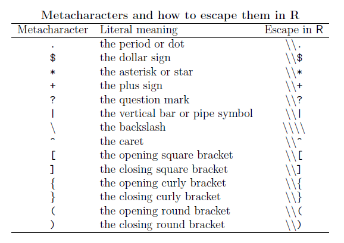

```{r, message=FALSE, echo=FALSE}
library(tidyverse)
```


The various types of operators, based on their main use can be grouped into to four basic operations for creating regular expressions

* Concatenation
* Logical OR
* Replication
* Grouping

These operations can be considered the building blocks of regular expressions operators. By combining them in several ways, we can represent very complicated and sophisticated patterns.

## metacharacters



Most characters, including all letters and digits, are regular expressions that match themselves. For example, "1" matches 1 and "blue" matches blue. However, there are some special characters that have a reserved status and they are known as _metacharacters_

As we can see from the table in R we have to escape special characters with double backlash `\\`. For example, if we want to remove th dollar sign from the string named `money`

```{r}
# string
money <- "$money"

# remove $ sign
money %>%
  str_remove("\\$")
```

We can see some other toy examples

```{r}
# plus
"Peace+Love" %>%
  str_remove("\\+")

# caret
"Peace^Love" %>%
  str_remove("\\^")

# vertical bar
"Peace|Love" %>%
  str_remove("\\|")

# opening round bracket
"Peace(Love)" %>%
  str_remove("\\(")

# closing round bracket
"Peace(Love)" %>%
  str_remove("\\)")

# double backslash
"Peace\\Love" %>%
  str_remove("\\\\")
```

## sequences


Sequences define, no surprinsingly, sequences of characters which can match. We have short-hand versions (or anchors) for commonly used sequences in R:

Let's see some examples

```{r}

# define string
string <- "the dandelion war 2010"


# replace first digit with '_'
string %>%
  str_replace("\\d", "_")

# replace all
string %>%
  str_replace_all("\\d", "_")

# replace non-digit with _
string %>%
  str_replace_all("\\D", "_")

# replace spaces with _
string %>%
  str_replace_all("\\s", "_")

# replace non-space with _
string %>%
  str_replace_all("\\S", "_")

# replace word with _
string %>%
  str_replace_all("\\w", "_")

# replace non-word with _
string %>%
  str_replace_all("\\W", "_")

# replace word boundary with _
string %>%
  str_replace_all("\\b", "_")

# replace non-word boundary with _
string %>%
  str_replace_all("\\B", "_")


```

## character classes


A character class or character set is a list of characters enclosed by square brackets [ ].

Character sets are used to match only one of several characters. For instance, the regex character class `[aA]` matches any lower case letter a or any upper case letter A. Likewise, the
regular expression `[0123456789]` matches any single digit.

A particular case of character classes is when we include the caret ^ at the beginning of the list: this indicates that the regular expression matches any character NOT in the list.

Let's see a basic example. Imagine that we have a character vector with several words and that we are interested in matching those words containing the vowels `e` or `i`. For this purpose, we can use the character class `[ei]`:

```{r}
# some string
transport <- c("car", "bike", "plane", "boat")

# matching words
transport %>%
  str_subset("[ei]")

# some numeric strings
numerics <- c("123", "17-April", "I-II-III", "R 3.0.1")

# match strings containing 0 or 1
numerics %>%
  str_subset("[01]")

# match any digit
numerics %>% 
  str_subset("[0-9]")

# match negated digit
numerics %>%
  str_subset("[^0-9]")
```

## POSIX character classes


Closely related to the regex character classes we have what is known as POSIX character classes. In R, POSIX character classes are represented with expressions inside double brackets `[[ ]]`.

We can see some examples:

```{r}
# la vie (string)
la_vie <- "La vie en #FFCOCB (rose); \nCes't la vie! \t tres jolie"

# remove space characters
la_vie %>%
  str_replace_all("[[:blank:]]", "")

# remove digits
la_vie %>%
  str_replace_all("[[:xdigit:]]", "")

# remove printable characters
la_vie %>%
  str_replace_all("[[:print:]]", "")

# remove graphical characters
la_vie %>%
  str_replace_all("[[:graph:]]", "")

# remove non-graphical characters
la_vie %>%
  str_replace_all("[^[:graph:]]", "")
  
```

##  quantifiers


These are used when we want to match a certain number of characters that meet certain criteria.
Quantifiers specify how many instances of a character, group, or character class must be present in the input for a match to be found

Some examples

```{r}
# people names
people <- c("rori", "emilia", "matteo", "mehmet", "filipe", "anna", "tyler",
            "rasmus", "jacob", "youna", "flora", "adi")

# match 'm' at most once
people %>%
  str_subset("m?")

# match 'm' exactly once
people %>%
  str_subset("m{1}")

# match 'm' zero or more times, and 't'
people %>%
  str_subset("m*t")

# match 't' zero or more times, and 'm'
people %>%
  str_subset("t*m")

# match 'm' one or more times
people %>%
  str_subset("m+")

# match 'm' one or more times, and 't'
people %>%
  str_subset("m+.t")

# match 't' exactly twice
people %>%
  str_subset("t{2}")

```

