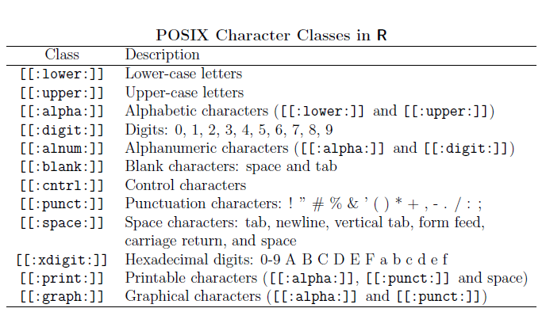
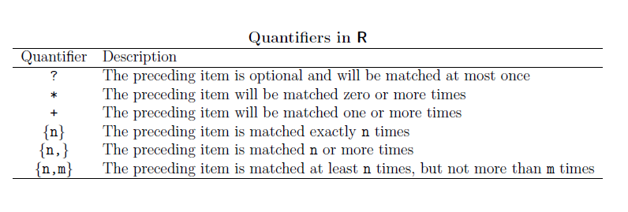

regex
================
DanielH
April 8, 2019

-   [metacharacters](#metacharacters)
-   [sequences](#sequences)
-   [character classes](#character-classes)
-   [POSIX character classes](#posix-character-classes)
-   [quantifiers](#quantifiers)

The various types of operators, based on their main use can be grouped into to four basic operations for creating regular expressions

-   Concatenation
-   Logical OR
-   Replication
-   Grouping

These operations can be considered the building blocks of regular expressions operators. By combining them in several ways, we can represent very complicated and sophisticated patterns.

metacharacters
--------------


Most characters, including all letters and digits, are regular expressions that match themselves. For example, "1" matches 1 and "blue" matches blue. However, there are some special characters that have a reserved status and they are known as *metacharacters*

As we can see from the table in R we have to escape special characters with double backlash `\\`. For example, if we want to remove th dollar sign from the string named `money`

``` r
# string
money <- "$money"

# remove $ sign
money %>%
  str_remove("\\$")
```

    ## [1] "money"

We can see some other toy examples

``` r
# plus
"Peace+Love" %>%
  str_remove("\\+")
```

    ## [1] "PeaceLove"

``` r
# caret
"Peace^Love" %>%
  str_remove("\\^")
```

    ## [1] "PeaceLove"

``` r
# vertical bar
"Peace|Love" %>%
  str_remove("\\|")
```

    ## [1] "PeaceLove"

``` r
# opening round bracket
"Peace(Love)" %>%
  str_remove("\\(")
```

    ## [1] "PeaceLove)"

``` r
# closing round bracket
"Peace(Love)" %>%
  str_remove("\\)")
```

    ## [1] "Peace(Love"

``` r
# double backslash
"Peace\\Love" %>%
  str_remove("\\\\")
```

    ## [1] "PeaceLove"

sequences
---------


Sequences define, no surprinsingly, sequences of characters which can match. We have short-hand versions (or anchors) for commonly used sequences in R:

Let's see some examples

``` r
# define string
string <- "the dandelion war 2010"


# replace first digit with '_'
string %>%
  str_replace("\\d", "_")
```

    ## [1] "the dandelion war _010"

``` r
# replace all
string %>%
  str_replace_all("\\d", "_")
```

    ## [1] "the dandelion war ____"

``` r
# replace non-digit with _
string %>%
  str_replace_all("\\D", "_")
```

    ## [1] "__________________2010"

``` r
# replace spaces with _
string %>%
  str_replace_all("\\s", "_")
```

    ## [1] "the_dandelion_war_2010"

``` r
# replace non-space with _
string %>%
  str_replace_all("\\S", "_")
```

    ## [1] "___ _________ ___ ____"

``` r
# replace word with _
string %>%
  str_replace_all("\\w", "_")
```

    ## [1] "___ _________ ___ ____"

``` r
# replace non-word with _
string %>%
  str_replace_all("\\W", "_")
```

    ## [1] "the_dandelion_war_2010"

``` r
# replace word boundary with _
string %>%
  str_replace_all("\\b", "_")
```

    ## [1] "_the_ _dandelion_ _war_ _2010_"

``` r
# replace non-word boundary with _
string %>%
  str_replace_all("\\B", "_")
```

    ## [1] "t_h_e d_a_n_d_e_l_i_o_n w_a_r 2_0_1_0"

character classes
-----------------


A character class or character set is a list of characters enclosed by square brackets \[ \].

Character sets are used to match only one of several characters. For instance, the regex character class `[aA]` matches any lower case letter a or any upper case letter A. Likewise, the regular expression `[0123456789]` matches any single digit.

A particular case of character classes is when we include the caret ^ at the beginning of the list: this indicates that the regular expression matches any character NOT in the list.

Let's see a basic example. Imagine that we have a character vector with several words and that we are interested in matching those words containing the vowels `e` or `i`. For this purpose, we can use the character class `[ei]`:

``` r
# some string
transport <- c("car", "bike", "plane", "boat")

# matching words
transport %>%
  str_subset("[ei]")
```

    ## [1] "bike"  "plane"

``` r
# some numeric strings
numerics <- c("123", "17-April", "I-II-III", "R 3.0.1")

# match strings containing 0 or 1
numerics %>%
  str_subset("[01]")
```

    ## [1] "123"      "17-April" "R 3.0.1"

``` r
# match any digit
numerics %>% 
  str_subset("[0-9]")
```

    ## [1] "123"      "17-April" "R 3.0.1"

``` r
# match negated digit
numerics %>%
  str_subset("[^0-9]")
```

    ## [1] "17-April" "I-II-III" "R 3.0.1"

POSIX character classes
-----------------------



Closely related to the regex character classes we have what is known as POSIX character classes. In R, POSIX character classes are represented with expressions inside double brackets `[[ ]]`.

We can see some examples:

``` r
# la vie (string)
la_vie <- "La vie en #FFCOCB (rose); \nCes't la vie! \t tres jolie"

# remove space characters
la_vie %>%
  str_replace_all("[[:blank:]]", "")
```

    ## [1] "Lavieen#FFCOCB(rose);\nCes'tlavie!tresjolie"

``` r
# remove digits
la_vie %>%
  str_replace_all("[[:xdigit:]]", "")
```

    ## [1] "L vi n #O (ros); \ns't l vi! \t trs joli"

``` r
# remove printable characters
la_vie %>%
  str_replace_all("[[:print:]]", "")
```

    ## [1] "\n\t"

``` r
# remove graphical characters
la_vie %>%
  str_replace_all("[[:graph:]]", "")
```

    ## [1] "     \n   \t  "

``` r
# remove non-graphical characters
la_vie %>%
  str_replace_all("[^[:graph:]]", "")
```

    ## [1] "Lavieen#FFCOCB(rose);Ces'tlavie!tresjolie"

quantifiers
-----------



These are used when we want to match a certain number of characters that meet certain criteria. Quantifiers specify how many instances of a character, group, or character class must be present in the input for a match to be found

Some examples

``` r
# people names
people <- c("rori", "emilia", "matteo", "mehmet", "filipe", "anna", "tyler",
            "rasmus", "jacob", "youna", "flora", "adi")

# match 'm' at most once
people %>%
  str_subset("m?")
```

    ##  [1] "rori"   "emilia" "matteo" "mehmet" "filipe" "anna"   "tyler" 
    ##  [8] "rasmus" "jacob"  "youna"  "flora"  "adi"

``` r
# match 'm' exactly once
people %>%
  str_subset("m{1}")
```

    ## [1] "emilia" "matteo" "mehmet" "rasmus"

``` r
# match 'm' zero or more times, and 't'
people %>%
  str_subset("m*t")
```

    ## [1] "matteo" "mehmet" "tyler"

``` r
# match 't' zero or more times, and 'm'
people %>%
  str_subset("t*m")
```

    ## [1] "emilia" "matteo" "mehmet" "rasmus"

``` r
# match 'm' one or more times
people %>%
  str_subset("m+")
```

    ## [1] "emilia" "matteo" "mehmet" "rasmus"

``` r
# match 'm' one or more times, and 't'
people %>%
  str_subset("m+.t")
```

    ## [1] "matteo" "mehmet"

``` r
# match 't' exactly twice
people %>%
  str_subset("t{2}")
```

    ## [1] "matteo"
