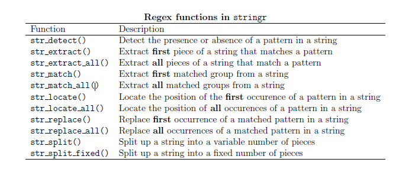

Untitled
================
DanielH
April 8, 2019

-   [Regex functions in stringr](#regex-functions-in-stringr)
-   [detecting patterns `str_detect()`](#detecting-patterns-str_detect)
-   [extract first match with `str_extract()`](#extract-first-match-with-str_extract)
-   [extract first match group with `str_match()`](#extract-first-match-group-with-str_match)
-   [extract all matched groups with `str_match all()`](#extract-all-matched-groups-with-str_match-all)
-   [locate first match with `str_locate()`](#locate-first-match-with-str_locate)
-   [locate all matches with `str_locate()`](#locate-all-matches-with-str_locate)
-   [Replace first match with `str_replace()`](#replace-first-match-with-str_replace)
-   [Replace all matches with `str_replace_all()`](#replace-all-matches-with-str_replace_all)
-   [string splitting with `str_split()`](#string-splitting-with-str_split)
-   [String splitting with str `split_fixed()`](#string-splitting-with-str-split_fixed)

From the book: <https://www.gastonsanchez.com/r4strings/>

``` r
library(tidyverse)
```

### Regex functions in stringr



The R package stringr also provides several functions for regex operations.

More specifically, stringr provides pattern matching functions to **detect**, **locate**, **extract**, **match**, **replace** and **split strings**.

------------------------------------------------------------------------

### detecting patterns `str_detect()`

``` r
# some objects
some_objs <- c("pen", "pencil", "marker", "spray")

# detect 'pen'
some_objs %>%
  str_detect("pen")
```

    ## [1]  TRUE  TRUE FALSE FALSE

``` r
# select detected macthes
some_objs[str_detect(some_objs, "pen")]
```

    ## [1] "pen"    "pencil"

``` r
# actually there's a function for the previous step
some_objs %>%
  str_subset("pen")
```

    ## [1] "pen"    "pencil"

Now we look at a more complicated example in which we use the function with regex

``` r
# some strings
strings <-
  c("12 Jun 2002", " 8 September 2004 ", "22-July-2009 ", "01 01 2001", 
    "date", "02.06.2000", "xxx-yyy-zzzz", "$2,600")

# date pattern (month as text)
dates <- "([0-9]{1,2})[- .]([a-zA-Z]+)[- .]([0-9]{4})"

# detect dates
strings %>%
  str_detect(dates)
```

    ## [1]  TRUE  TRUE  TRUE FALSE FALSE FALSE FALSE FALSE

### extract first match with `str_extract()`

``` r
# tweets about Paris
paris_tweets <- 
  c("#Paris is chock-full of cultural and culinary attractions",
    "Some time in #Paris along Canal St.-Martin famous by #Amelie",
    "While youre in #Paris, stop at cafe: http://goo.gl/yaCbW",
    "Paris, the city of light")

# hashtag pattern
hash <- "#[a-zA-Z]{1,}"

paris_tweets %>%
  str_extract(hash)
```

    ## [1] "#Paris" "#Paris" "#Paris" NA

As we can see, the output of str extract() is a vector of same length as string. Those elements that don't match the pattern are indicated as `NA`.

Note that `str extract()` only matches the first pattern: it didn't extract the hashtag "\#Amelie".

#### extract all matches with `str_extract_all()`

``` r
paris_tweets %>%
  str_extract_all(hash)
```

    ## [[1]]
    ## [1] "#Paris"
    ## 
    ## [[2]]
    ## [1] "#Paris"  "#Amelie"
    ## 
    ## [[3]]
    ## [1] "#Paris"
    ## 
    ## [[4]]
    ## character(0)

Compared to `str_extract()` , the output of `str extract_all()` is a list of same length as string. In addition, those elements that don't match the pattern are indicated with an empty character vector `character(0)` instead of `NA`.

### extract first match group with `str_match()`

Closely related to `str_extract()` the package stringr offers another extracting function: `str_match()`. This function not only extracts the matched pattern but it also shows each of the matched groups in a regex character class pattern.

``` r
# -------------- we use the 'strings' and 'dates' objects we created earlier

strings <-
  c("12 Jun 2002", " 8 September 2004 ", "22-July-2009 ", "01 01 2001", 
    "date", "02.06.2000", "xxx-yyy-zzzz", "$2,600")


dates <- "([0-9]{1,2})[- .]([a-zA-Z]+)[- .]([0-9]{4})"  # regex pattern

strings %>%
  str_match(dates)
```

    ##      [,1]               [,2] [,3]        [,4]  
    ## [1,] "12 Jun 2002"      "12" "Jun"       "2002"
    ## [2,] "8 September 2004" "8"  "September" "2004"
    ## [3,] "22-July-2009"     "22" "July"      "2009"
    ## [4,] NA                 NA   NA          NA    
    ## [5,] NA                 NA   NA          NA    
    ## [6,] NA                 NA   NA          NA    
    ## [7,] NA                 NA   NA          NA    
    ## [8,] NA                 NA   NA          NA

Note that the output is not a vector but a character matrix. The first column is the complete match, the other columns are each of the captured groups. For those unmatched elements, there is a missing value NA.

### extract all matched groups with `str_match all()`

If what we're looking for is extracting all patterns in a string vector, instead of using `str_match()` we should use `str_match_all()`:

``` r
# -------------- we use the 'paris_tweets' and 'hash' objects we created earlier

paris_tweets  %>%
  str_match_all(hash)
```

    ## [[1]]
    ##      [,1]    
    ## [1,] "#Paris"
    ## 
    ## [[2]]
    ##      [,1]     
    ## [1,] "#Paris" 
    ## [2,] "#Amelie"
    ## 
    ## [[3]]
    ##      [,1]    
    ## [1,] "#Paris"
    ## 
    ## [[4]]
    ##      [,1]

Compared to `str_match()`, the output of `str_match_all()` is a list.

Note also that each element of the list is a matrix with as many rows as hashtag matches.

In turn, those elements that don't match the pattern are indicated with an empty character vector `character(0)` instead of a `NA`.

### locate first match with `str_locate()`

stringr allows us to locate occurences of patterns. For locating the position of the first occurence of a pattern in a string vector, we should use `str_locate()`.

``` r
# locate position of (first) hashtag
paris_tweets %>%
  str_locate("#[a-zA-Z]{1,}")
```

    ##      start end
    ## [1,]     1   6
    ## [2,]    14  19
    ## [3,]    16  21
    ## [4,]    NA  NA

The output of `str_locate()` is a matrix with two columns and as many rows as elements in the (string) vector. The first column of the output is the start position, while the second column is the end position.

The first row corresponds to the hashtag of the first tweet. It starts at position 1 and ends at position 6.

The second row corresponds to the hashtag of the second tweet. Its start position is the 14th character, and its end position is the 19th character.

The fourth row corresponds to the fourth tweet. Since there are no hashtags the values in that row are NA's.

### locate all matches with `str_locate()`

To locate not just the first but all the occurence patterns in a string vector, we should use `str_locate_all()`:

``` r
# locate (all) hashtags in paris_tweets
paris_tweets %>%
  str_locate_all("#[a-zA-Z]{1,}") 
```

    ## [[1]]
    ##      start end
    ## [1,]     1   6
    ## 
    ## [[2]]
    ##      start end
    ## [1,]    14  19
    ## [2,]    54  60
    ## 
    ## [[3]]
    ##      start end
    ## [1,]    16  21
    ## 
    ## [[4]]
    ##      start end

Compared to `str_locate()`, the output of `str_locate_all()` is a list of the same length as the provided string.

Each of the list elements is in turn a matrix with two columns.

Those elements that don't match the pattern are indicated with an empty character vector instead of an `NA`.

### Replace first match with `str_replace()`

Say we have the city names of San Francisco, Barcelona, Naples and Paris in a vector. And let's suppose that we want to replace the first vowel in each name with a semicolon.

``` r
cities <- c("San Francisco", "Barcelona", "Naples", "Paris")

cities %>%
  str_replace("[aeiou]", ";")
```

    ## [1] "S;n Francisco" "B;rcelona"     "N;ples"        "P;ris"

Now, suppose that we want to replace the rst consonant in each name.

``` r
cities %>%
  str_replace("[^aeiou]", ";")
```

    ## [1] ";an Francisco" ";arcelona"     ";aples"        ";aris"

### Replace all matches with `str_replace_all()`

For replacing all occurrences of a matched pattern in a string, we can use `str_replace_all()`.

Let's suppose that we want to replace all the vowels in each name:

``` r
# replace all matched vowels
cities %>%
  str_replace_all("[aeiou]", ";")
```

    ## [1] "S;n Fr;nc;sc;" "B;rc;l;n;"     "N;pl;s"        "P;r;s"

Alternatively, to replace all consonants with a semicolon in each name

``` r
cities %>%
  str_replace_all("[^aeiou]", ";")
```

    ## [1] ";a;;;;a;;i;;o" ";a;;e;o;a"     ";a;;e;"        ";a;i;"

### string splitting with `str_split()`

The function `str_split()` is used to separate a character vector into a number of pieces. This function has the following usage:

`str_split(string, pattern, n = Inf)` \# default parameters

The argument n is the maximum number of pieces to return. The default value (`n = Inf`) implies that all possible split positions are used.

``` r
# a sentence
sentence <- c("R is a collaborative project with many contributors")

# split into words
sentence %>%
  str_split(" ")
```

    ## [[1]]
    ## [1] "R"             "is"            "a"             "collaborative"
    ## [5] "project"       "with"          "many"          "contributors"

Likewise, we can break apart the portions of a telephone number by splitting those sets of digits joined by a dash `-`

``` r
# telephone numbers
tels <- c("510-548-2238", "707-231-2440", "650-752-1300")

# split
tels %>%
  str_split("-")
```

    ## [[1]]
    ## [1] "510"  "548"  "2238"
    ## 
    ## [[2]]
    ## [1] "707"  "231"  "2440"
    ## 
    ## [[3]]
    ## [1] "650"  "752"  "1300"

The result is a list of character vectors. Each element of the string vector corresponds to an element in the resulting list.

In order to show the use of the argument *n*, let's consider a vector with flavors "chocolate", "vanilla", "cinnamon", "mint", and "lemon". Suppose we want to split each flavor name defining as pattern the class of vowels

``` r
# string
flavors <- c("chocolate", "vanilla", "cinnamon", "mint", "lemon")

flavors %>%
  str_split("[aeiou]")
```

    ## [[1]]
    ## [1] "ch" "c"  "l"  "t"  ""  
    ## 
    ## [[2]]
    ## [1] "v"  "n"  "ll" ""  
    ## 
    ## [[3]]
    ## [1] "c"  "nn" "m"  "n" 
    ## 
    ## [[4]]
    ## [1] "m"  "nt"
    ## 
    ## [[5]]
    ## [1] "l" "m" "n"

Now let's modify the maximum number of pieces to n = 2. This means that `str_split()` will split each element into a maximum of 2 pieces

``` r
# split by first vowel
flavors %>%
  str_split("[aeiou]", n = 2)
```

    ## [[1]]
    ## [1] "ch"     "colate"
    ## 
    ## [[2]]
    ## [1] "v"     "nilla"
    ## 
    ## [[3]]
    ## [1] "c"      "nnamon"
    ## 
    ## [[4]]
    ## [1] "m"  "nt"
    ## 
    ## [[5]]
    ## [1] "l"   "mon"

### String splitting with str `split_fixed()`

In addition to `str_split()`, there is also the str `split_fixed()` function that splits up a string into a fixed number of pieces.

`str_split_fixed(string, pattern, n)` \# default function

``` r
# string
flavors <- c("chocolate", "vanilla", "cinnamon", "mint", "lemon")

# split flavors into 2 pieces
flavors %>%
  str_split_fixed("n", 2)
```

    ##      [,1]        [,2]   
    ## [1,] "chocolate" ""     
    ## [2,] "va"        "illa" 
    ## [3,] "ci"        "namon"
    ## [4,] "mi"        "t"    
    ## [5,] "lemo"      ""

As we can see, the output is a character matrix with as many columns as n = 2. Since "chocolate" does not contain any letter "n", its corresponding value in the second column remains empty "".

In contrast, the value of the second column associated to "lemon" is also empty. But this is because this flavor is split up into "lemo" and "".

If we change the value n = 3, we will obtain a matrix with three columns:

``` r
# string
flavors <- c("chocolate", "vanilla", "cinnamon", "mint", "lemon")

# split flavors into 3 pieces
flavors %>%
  str_split_fixed("n", 3)
```

    ##      [,1]        [,2]   [,3]  
    ## [1,] "chocolate" ""     ""    
    ## [2,] "va"        "illa" ""    
    ## [3,] "ci"        ""     "amon"
    ## [4,] "mi"        "t"    ""    
    ## [5,] "lemo"      ""     ""
